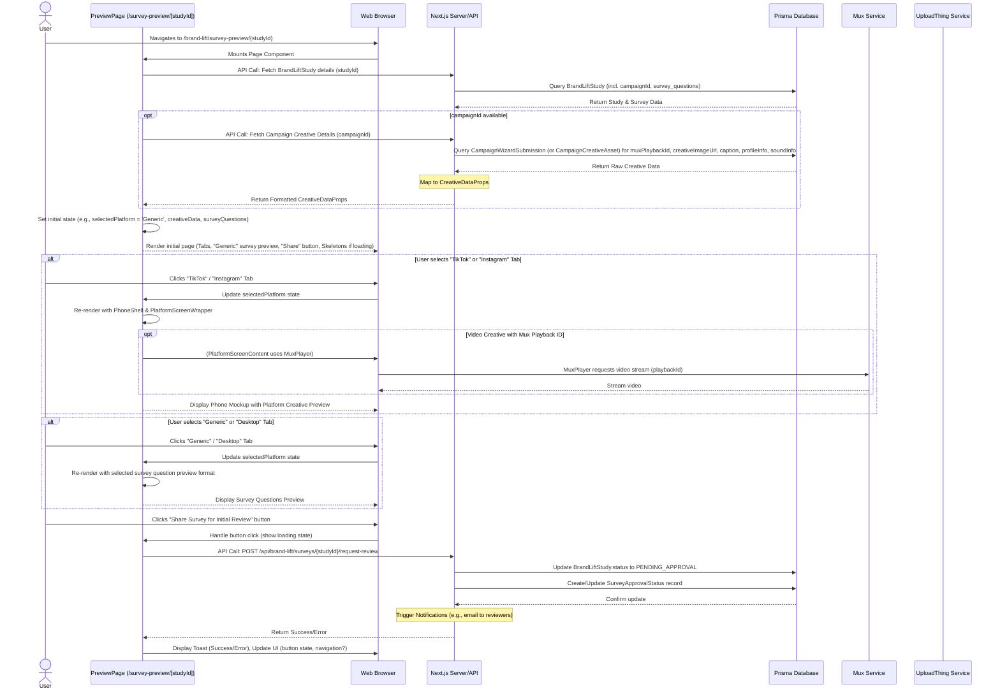

# Brand Lift: Preview & Submit Survey - Implementation Plan

**Objective**: Enhance the "Preview & Submit Survey" page (`src/app/brand-lift/survey-preview/[studyId]/page.tsx`) to include a realistic phone mockup that previews the associated campaign's creative as it would appear on selected social media platforms (TikTok, Instagram), based on the Figma design (`@Survey Approval Screen.png` - left side), and ensure the entire page functionality is robust, user-friendly, and meticulously planned.

## 1. Current Status (Based on Provided Screenshots)

*   The page currently exists and displays the study name.
*   Platform tabs ("Generic", "TikTok", "Instagram", "Desktop") are present.
*   When "TikTok" or "Instagram" is selected, a "[Creative Placeholder]" is shown.
*   The "Generic" view (and possibly others) currently previews the *survey questions* themselves, not the campaign creative.

## 2. Target Design (Based on Figma: `@Survey Approval Screen.png`)

*   **Phone Mockup (Left side of Figma)**: A visually accurate representation of a smartphone displaying the *campaign creative* as it would appear on the selected platform.
*   **Platform Emulation**:
    *   **TikTok**: Mockup to include TikTok's UI elements.
    *   **Instagram**: Mockup to include Instagram's UI elements.
*   **Dynamic Content (from Campaign Wizard data for `studyId`'s campaign)**:
    *   User Profile Picture and Name (e.g., "Name and Last name" in Figma). *Data Source: Must be clearly mapped from `CampaignWizardSubmission` or related creative asset model – see Section 4.*
    *   Post Caption (e.g., "Caption of the post #fyp"). *Data Source: As above.*
    *   Media: Video (via Mux) or Image (via UploadThing).
    *   Sound information (TikTok - e.g., "Song name - song artist"). *Data Source: As above. Scrolling effect is a polish item.*
    *   Engagement metrics (likes, comments, shares): For MVP, these will be **static, illustrative placeholders** within the platform preview components. Real-time or fetched metrics are out of scope for this preview mockup.
*   **Interactivity**: Platform tabs switch phone mockup content.
*   **"Share Survey for Initial Review" Button**: Prominently displayed, triggering the review workflow.
*   **Clarification on Figma Usage**: The right-hand side of `@Survey Approval Screen.png` (depicting a survey respondent's view) is **distinct** from this page's creative preview. This "Preview & Submit Survey" page uses its "Generic" tab for previewing the survey questions structure. The platform-specific tabs focus on the *creative* preview within the phone mockup.
*   **"Desktop" Tab Strategy**:
    *   **Decision Required**: The content and purpose of the "Desktop" tab (wider survey preview vs. desktop creative preview) must be finalized before its UI implementation. If desktop creatives are relevant, their data source also needs to be defined.
    *   *Initial Recommendation*: If desktop-specific campaign creatives are not a core, defined feature, this tab should provide a wider, desktop-friendly preview of the survey questions.
*   **Minor UI Details from Figma (TikTok)**: Note elements like "Show translation" (likely static text for MVP) for high-fidelity mockups.

## 3. Implementation Steps

### Step 3.1: Data Fetching and Preparation (Page Level)

*   **Goal**: Ensure all necessary data (study details, survey questions, campaign creative assets) is reliably fetched and available to the page component.
*   **Tasks**:
    1.  **Primary Data Fetching (`page.tsx`)**:
        *   On page load, fetch `BrandLiftStudy` details using `studyId` (this should include `campaignId` and associated survey questions/options).
        *   Using the obtained `campaignId`, fetch `CreativeDataProps` (see Section 4 for definition).
    2.  **API for Creative Details**:
        *   **Endpoint**: Confirm or create `/api/campaigns/{campaignId}/creative-details`.
        *   **Data Source**: Retrieve creative asset info (Mux `playbackId`, UploadThing image URLs, caption, profile info, sound details) from confirmed Prisma storage (see Task 3.1.3). Ensure fields exist in `CampaignWizardSubmission` or linked model for *all* dynamic content shown in Figma mockups (profile name, pic, caption, sound).
        *   **Mapping**: Implement clear mapping from Prisma to `CreativeDataProps`.
    3.  **Prisma Schema for Creative Assets (Critical Prerequisite)**:
        *   **Action**: Ensure `CampaignWizardSubmission` or a new linked model (e.g., `CampaignCreativeAsset`) in `schema.prisma` is updated/created to store all necessary fields for `CreativeDataProps`: `creativeImageUrl: String?`, `muxPlaybackId: String?`, and source fields for `CreativeProfileData` (name, username, profilePictureUrl) & `CreativeSoundData` (songName, artistName), if not already present and clearly identifiable on `CampaignWizardSubmission` itself.
        *   Run migrations.
    4.  **State Management**: Utilize efficient client-side state management for fetched data and UI state (e.g., `selectedPlatform`).

### Step 3.2: Core Page Structure & Functionality

*   **Goal**: Implement the main layout, tab navigation, and the "Share Survey for Initial Review" workflow.
*   **Tasks**:
    1.  **Page Component (`src/app/brand-lift/survey-preview/[studyId]/page.tsx`)**:
        *   Structure main layout (header, tab container, preview area, action button area).
        *   Implement Tab component (e.g., Shadcn `Tabs`) for platform switching ("Generic", "TikTok", "Instagram", "Desktop"). Update `selectedPlatform` state on tab change.
    2.  **"Generic" & "Desktop" Tab Content**:
        *   **Generic**: Render a clean, platform-agnostic preview of survey questions and options fetched in Step 3.1.1.
        *   **Desktop**: Implement based on the finalized strategy (Task from Section 2).
    3.  **"Share Survey for Initial Review" Button**:
        *   UI: Implement the button as per Figma.
        *   `onClick` Handler:
            *   Call API: `POST /api/brand-lift/surveys/{studyId}/request-review`.
            *   Backend Logic for API: Update `BrandLiftStudy.status` to `PENDING_APPROVAL` (or `IN_REVIEW`), create/update `SurveyApprovalStatus`, trigger notifications.
            *   Frontend Feedback: Display success/error toast, update button state (e.g., "Review Requested"), define post-action navigation or UI update.
    4.  **Loading & Error States (Page Level)**: Implement comprehensive skeleton loaders for all data-dependent sections and clear error messages for API failures.

### Step 3.3: Phone Mockup Implementation (Iterative Enhancement)
    *(Refer to Section 8.II for detailed component breakdown: PhoneShell, PlatformScreenWrapper, TikTok/InstagramScreenContent, Atomic sub-components)*
*   **Goal**: Develop a high-fidelity, reusable phone mockup for creative previews.
*   **Tasks**:
    1.  **`PhoneShell.tsx` (`src/components/ui/phone-shell.tsx`)**: Create the physical phone frame (generic modern design initially, with potential for more realistic bezels/notch as an iteration).
    2.  **`PlatformScreenWrapper.tsx` (...`/previews/PlatformScreenWrapper.tsx`)**: Manages content *within* the phone shell, including the static device status bar (time, battery, signal) and conditional rendering of platform content.
    Integrate into `page.tsx`: When "TikTok" or "Instagram" tab is active, render `<PhoneShell><PlatformScreenWrapper platform={selectedPlatform} creativeData={...} /></PhoneShell>`.

### Step 3.4: Platform-Specific Creative Previews
    *(Refer to Section 8.II for details on TikTokScreenContent, InstagramScreenContent, Mux Player integration, icons, fonts, text handling, and fallbacks)*
*   **Goal**: Accurately emulate TikTok and Instagram post/reel views with dynamic creative content.
*   **Tasks**:
    1.  **`TikTokScreenContent.tsx`**: Implement UI, map `creativeData`, integrate Mux Player (using `muxPlaybackId`), use correct FontAwesome icons (e.g., `faPlayLight` for sound, to be visually verified against actual TikTok).
    2.  **`InstagramScreenContent.tsx`**: Implement UI, map `creativeData`, integrate Mux Player/image display, use correct FontAwesome icons.
    3.  **Atomic Sub-components**: Develop smaller, reusable parts for each platform preview (headers, action bars, etc.).

### Step 3.5: Overall Polish & Quality Assurance
*   **Goal**: Ensure a high-quality, robust, and accessible page.
*   **Tasks**:
    1.  **Styling & Visual Fidelity**: Meticulous Tailwind CSS styling for all elements, aiming for platform accuracy in mockups.
    2.  **Responsiveness**: Ensure the entire page (not just the phone mockup internals) is responsive.
    3.  **Accessibility (WCAG 2.1 AA)**: Thorough review and implementation.
    4.  **Testing**: Implement unit, integration, and E2E tests covering all functionalities. (Refer to Section 8.III.14).

## 4. Data Flow and Types
*   **`CreativeDataProps` Definition (in `src/types/brand-lift.ts` or shared types)**:
    ```typescript
    export interface CreativeProfileData {
      name: string;         // Source: Mapped from CampaignWizardSubmission field (e.g., campaignContactName or a dedicated adProfileName)
      username?: string;     // Source: Mapped from CampaignWizardSubmission field (e.g., adProfileUsername)
      profilePictureUrl?: string | null; // Source: Mapped from CampaignWizardSubmission field (e.g., adProfileImageUrl from UploadThing, or a dedicated field)
    }

    export interface CreativeMediaData {
      // url?: string; // Consider removing if muxPlaybackId and imageUrl cover all cases
      type: 'image' | 'video';
      altText?: string;     // Source: Mapped from CampaignWizardSubmission field
      imageUrl?: string | null; // For direct images from UploadThing
      muxPlaybackId?: string | null; // For Mux videos
    }

    export interface CreativeSoundData {
      songName?: string;    // Source: Mapped from CampaignWizardSubmission field (e.g., creativeSoundTitle)
      artistName?: string;  // Source: Mapped from CampaignWizardSubmission field (e.g., creativeSoundArtist)
    }

    export interface CreativeDataProps {
      profile: CreativeProfileData;
      caption: string;        // Source: Mapped from CampaignWizardSubmission field (e.g., adCaption)
      media: CreativeMediaData;
      sound?: CreativeSoundData; // Source: Mapped from CampaignWizardSubmission fields
      // Potentially add: campaignName, studyName for context if needed within previews
      // Illustrative (static for MVP) engagement counts can be hardcoded in preview components
    }
    ```
*   **Critical Task**: (Keep existing content: Explicitly map these `CreativeDataProps` fields...)

## 5. Component Structure (Proposed - Hyper Modular)
*   `src/app/brand-lift/survey-preview/[studyId]/page.tsx`
*   `src/components/ui/phone-shell.tsx` (The physical phone frame)
*   `src/components/features/brand-lift/previews/PlatformScreenWrapper.tsx` (Manages screen content: status bar, platform views)
*   `src/components/features/brand-lift/previews/tiktok/TikTokScreenContent.tsx`
    *   `src/components/features/brand-lift/previews/tiktok/TikTokHeader.tsx`
    *   `src/components/features/brand-lift/previews/tiktok/TikTokSidebarActions.tsx`
    *   `src/components/features/brand-lift/previews/tiktok/TikTokFooterInfo.tsx`
*   `src/components/features/brand-lift/previews/instagram/InstagramScreenContent.tsx`
    *   `src/components/features/brand-lift/previews/instagram/InstagramPostHeader.tsx`
    *   `src/components/features/brand-lift/previews/instagram/InstagramActionButtons.tsx`
    *   `src/components/features/brand-lift/previews/instagram/InstagramPostInfo.tsx`
*   `src/components/features/brand-lift/SurveyQuestionPreviewList.tsx` (For "Generic" / "Desktop" tabs)

## 6. Key Considerations
*   **Accuracy vs. Feasibility**: Balance high-fidelity mockup details with development effort.
*   **Video Handling**: Use `@mux/mux-player-react` with `playbackId`. Ensure smooth playback, appropriate controls/autoplay for previews.
*   **FontAwesome Icons**: Use `Icon` component. For TikTok sound, `faPlayLight` is the current stand-in; verify visual similarity to actual TikTok UI and consider a custom SVG if a closer match from `icon-registry.ts` isn't found and high fidelity is paramount.
*   **Performance**: Optimize data fetching and rendering. Mux player is generally performant.
*   **Data Mapping**: Crucial for connecting backend data to `CreativeDataProps`.
*   **Content Security Policy (CSP)**: If the project uses a strict CSP, ensure Mux domains (for player and video streams) and UploadThing domains (for images) are permitted in relevant directives (`script-src`, `media-src`, `img-src`, `frame-src`, `connect-src`).

## 7. Next Steps (Iterative Development)
1.  **Confirm Data Model for Creatives**: Finalize Prisma schema changes for storing Mux `playbackId` / UploadThing URLs for campaign creatives.
2.  **API for Creative Details**: Implement the API to fetch and map this data to `CreativeDataProps`.
3.  **Page Structure & Generic Preview**: Implement `page.tsx` basics, tab switching, "Generic" survey question preview.
4.  **`PhoneShell.tsx`**: Build the basic phone frame.
5.  **`PlatformScreenWrapper.tsx`**: Implement logic for dynamic content and static device chrome.
6.  **`TikTokScreenContent.tsx`**: Develop with Mux player and atomic sub-components.
7.  **`InstagramScreenContent.tsx`**: Develop similarly.
8.  **"Share for Review" Button**: Implement UI and backend logic.
9.  **Styling, Polish, Testing, Accessibility**: Iteratively throughout.

## 8. Achieving a 10/10 Implementation: Comprehensive Plan for "Preview & Submit Survey" Page
    (This section has been promoted and integrated into the main plan above for a holistic view.)
    The principles outlined previously (Modularity, Storybook, Realism, Developer Experience, Future-Proofing) are now woven into the detailed steps in Sections 3-7. Key enhancements include:
    *   Explicit Prisma schema considerations for creative assets (Mux IDs, UploadThing URLs).
    *   Clearer data flow for `CreativeDataProps`.
    *   Refined component structure (`PhoneShell.tsx`, `PlatformScreenWrapper.tsx`, and atomic children for platform views).
    *   Integration of Mux player details.
    *   Emphasis on holistic page elements beyond just the mockup (Generic/Desktop tabs, Share button workflow, loading/error states, accessibility).

## 9. User Flow & System Interaction Diagram



**Key Interactions & States:** (Keep existing content)

## 10. Detailed Implementation Checklist

**Current Focus: Finalizing Core Page Actions & Addressing API Type Issues**

**Phase 0: Prerequisites & Setup**
*   [DONE] **Prisma**: Schema updated for `CreativeAsset` with `muxPlaybackId`, `isPrimaryForBrandLiftPreview`, and `@updatedAt`. Migrations run.
*   [DONE] **Types**: `CreativeDataProps` in `src/types/brand-lift.ts` finalized to align with data sourcing decisions.
*   [DONE] **Dependencies**: Install `@mux/mux-player-react`.

**Phase 1: Backend for Preview Page**
*   [BLOCKED/NEEDS LOCAL TS DEBUG] **API**: Implement/Verify `/api/campaigns/{campaignId}/creative-details` endpoint.
    *   [DONE] Core logic for data fetching, primary asset selection, initial mapping, auth is in place.
    *   [BLOCKED] Persistent TypeScript/Prisma Client type inference errors are preventing reliable remote updates by the AI. Requires local developer intervention to resolve type errors in the current file: `src/app/api/campaigns/[campaignId]/creative-details/route.ts`.
    *   [ ] **TODO (Post Type-Fix)**: Implement live InsightIQ API call for `CreativeDataProps.profile.profilePictureUrl`.
    *   [ ] **TODO (Post Type-Fix)**: Thoroughly test API.
*   [IN PROGRESS] **API**: Create and implement `/api/brand-lift/surveys/[studyId]/preview-details` endpoint.
    *   [DONE] Core logic implemented and type issues resolved.
    *   [ ] **TODO**: Thoroughly test API.
*   [IN PROGRESS] **API**: Implement `POST /api/brand-lift/surveys/{studyId}/request-review` endpoint.
    *   [DONE] Core logic implemented (status updates, approval record upsert, auth).
    *   [ ] **TODO**: Implement notification trigger (e.g., `NotificationService.studySubmittedForReview(...)`).
    *   [ ] **TODO**: Thoroughly test API.

**Phase 2: Core Page Structure & Non-Mockup Previews (`.../survey-preview/[studyId]/page.tsx`)**
*   [IN PROGRESS] **Page Component & Data Fetching**:
    *   [DONE] Initial setup: Data fetching calls for study details and creative details (latter pending API type fixes).
    *   [DONE] Client-side state management for data, loading, error, selectedPlatform.
    *   [DONE] Shadcn `Tabs` implemented for platform switching.
    *   [DONE] Basic rendering of study name; loading skeletons; error alerts.
    *   [IN PROGRESS] "Generic" & "Desktop" Tabs: Connected to `SurveyQuestionPreviewList` with `studyDetails.questions`.
    *   [IN PROGRESS] "TikTok"/"Instagram" Tabs: Render `PhoneShell` with `PlatformScreenWrapper` (passes `creativeDetails` if available).
    *   [DONE] "Share Survey for Initial Review" Button: UI, `onClick` handler calls API, uses toasts, navigates on success, dynamic button disabled/text states implemented.
        *   [ ] **USER VERIFICATION NEEDED**: Confirm `<Toaster />` is in main layout for toasts to appear.
        *   [ ] **USER VERIFICATION NEEDED**: Confirm navigation to `/brand-lift/approval/${studyId}` is desired UX.

**Phase 3: Phone Mockup UI**
*   [ ] **`PhoneShell.tsx` (`src/components/ui/phone-shell.tsx`)**:
    *   [ ] Create file with basic stateless component structure (receives `children`, `className?`).
    *   [ ] Style with Tailwind for a clean, generic phone frame (bezel, rounded corners, defined screen area).
    *   [ ] (Storybook) Basic story.
*   [ ] **`PlatformScreenWrapper.tsx` (`.../previews/PlatformScreenWrapper.tsx`)**:
    *   [ ] Create file. Props: `platform`, `creativeData`.
    *   [ ] Implement static device status bar (time, battery, signal - visual only).
    *   [ ] Conditional logic to render `TikTokScreenContent` or `InstagramScreenContent` based on `platform`.
    *   [ ] (Storybook) Stories with mock `creativeData`.
*   **Integration in `page.tsx`**:
    *   [ ] Conditionally render `<PhoneShell><PlatformScreenWrapper ... /></PhoneShell>` for "TikTok" & "Instagram" tabs.

**Phase 4: Platform-Specific Creative Content Renderers**
*   **`TikTokScreenContent.tsx` (`.../previews/tiktok/TikTokScreenContent.tsx`)**:
    *   [ ] Create file and atomic sub-components directory (`.../tiktok/`).
    *   [ ] Main layout for TikTok feed item.
    *   [ ] Render dynamic content from `creativeData`: profile info, caption, media.
    *   [ ] Media: Use `@mux/mux-player-react` for `muxPlaybackId`, `` for `creativeData.media.imageUrl`. Handle `type: 'video' | 'image'`.
    *   [ ] Static UI elements: Icons (`faPlayLight` for sound, etc.), sidebars, footers. Style accurately.
    *   [ ] (Storybook) Stories for component and its children with varied `creativeData`.
*   **`InstagramScreenContent.tsx` (`.../previews/instagram/InstagramScreenContent.tsx`)**:
    *   [ ] Create file and atomic sub-components directory (`.../instagram/`).
    *   [ ] Main layout for Instagram Reel/Post.
    *   [ ] Render dynamic content from `creativeData`.
    *   [ ] Media: Mux player / ``.
    *   [ ] Static UI elements: Icons, headers, action bars. Style accurately.
    *   [ ] (Storybook) Stories.

**Phase 5: Polish, Iteration & Quality Assurance**
*   [ ] **Visual Fidelity**: Iteratively refine `PhoneShell` (bezels/notch if prioritized), platform content styling (fonts, icon details, text overflow) for TikTok & Instagram.
*   [ ] **Error/Fallback States**: Ensure graceful handling for missing creative data within mockups.
*   [ ] **Responsiveness**: Test and ensure the overall page layout is responsive.
*   [ ] **Accessibility**: Full WCAG 2.1 AA review for the page and all new components.
*   [ ] **Testing**: Implement Jest (unit/integration) and Cypress (E2E) tests covering new components and user flows.
*   [ ] **Documentation**: Add JSDoc to all new components. Update Storybook documentation.

## 11. Jira Ticket Breakdown (Suggested Structure)

**Epic 0: Foundation & Backend Prerequisites**
*   **Story/Task (BE-CORE-1)**: Finalize & Implement Prisma Schema for Campaign Creative Assets
    *   *Description*: Decide on storage (new `CampaignCreativeAsset` model vs. fields on `CampaignWizardSubmission`). Implement schema changes, run migrations. (Corresponds to Checklist Phase 0)
*   **Story/Task (BE-CORE-2)**: Develop API: `/api/campaigns/{campaignId}/creative-details`
    *   *Description*: ... **Status: BLOCKED by TypeScript errors requiring local resolution.** Implement InsightIQ call post-fix.

**Epic 1: Backend - Survey Lifecycle & Review Workflow APIs**
*   **Story/Task (BE-SURVEY-1)**: API: `POST /api/brand-lift/surveys/{studyId}/request-review` (Next up)

**Epic 2: Survey Preview Page - Core UI & Generic/Desktop Views** 
*   **Story/Task (FE-PAGE-1)**: Develop Preview Page Shell, Data Fetching Hooks, and Tab Structure
    *   *Description*: Base `page.tsx` setup, fetch study/survey data, fetch creative data (using BE-CORE-2). Implement tabs.
*   **Story/Task (FE-PAGE-2)**: Implement "Generic" Tab: Render `SurveyQuestionPreviewList` component for generic question display.
*   **Story/Task (FE-PAGE-3)**: Implement "Desktop" Tab: Implement based on finalized strategy (e.g., wider `SurveyQuestionPreviewList`).
*   **Story/Task (FE-PAGE-4)**: Implement "Share Survey for Initial Review" Button: UI and `onClick` to call API, handle loading/toast feedback, update UI post-submit.
*   **Story/Task (FE-PAGE-5)**: Implement page-level skeleton loaders and error alert displays.

**Epic 3: Phone Mockup UI & Platform Emulation** (Component development can start with mock data)
*   **Story/Task (FE-MOCKUP-1)**: Create `PhoneShell.tsx` Component (Physical UI Frame)
*   **Story/Task (FE-MOCKUP-2)**: Create `PlatformScreenWrapper.tsx` (Screen Content Manager & Static Device Chrome)
*   **Story/Task (FE-MOCKUP-3A)**: Develop `TikTokScreenContent.tsx` - Layout & Static UI
*   **Story/Task (FE-MOCKUP-3B)**: Develop `TikTokScreenContent.tsx` - Dynamic Data & Mux Player Integration
*   **Story/Task (FE-MOCKUP-3C)**: Create Atomic Sub-components for TikTok Preview (e.g., `TikTokSidebarActions`)
*   **Story/Task (FE-MOCKUP-4A)**: Develop `InstagramScreenContent.tsx` - Layout & Static UI
*   **Story/Task (FE-MOCKUP-4B)**: Develop `InstagramScreenContent.tsx` - Dynamic Data & Mux Player/Image Integration
*   **Story/Task (FE-MOCKUP-4C)**: Create Atomic Sub-components for Instagram Preview
*   **Story/Task (FE-MOCKUP-5)**: Integrate Phone Mockup into Preview Page (as before)
*   **Story/Task (FE-MOCKUP-6)**: Styling Polish & Realism Iteration (as before, can be ongoing)

**Epic 4: Quality, Testing & Finalization** (as before)

This detailed breakdown should provide a clear path for execution and tracking progress.

## Progress Log

*   **[Date]**: Plan for "Preview & Submit Survey" page significantly enhanced...
*   **[Date]**: Initial shell files created: `PhoneShell.tsx`, `PlatformScreenWrapper.tsx`, `TikTokScreenContent.tsx`, `InstagramScreenContent.tsx`, `SurveyQuestionPreviewList.tsx`.
*   **[Date]**: Prisma schema updated for `CreativeAsset`... Migrations applied.
*   **[Date]**: `CreativeDataProps` type in `src/types/brand-lift.ts` updated...
*   **[Date]**: `@mux/mux-player-react` dependency installed.
*   **[Date]**: API route `/api/campaigns/[campaignId]/creative-details/route.ts` implemented and refined...
*   **[Date]**: API route `/api/brand-lift/surveys/[studyId]/preview-details/route.ts` implementation refined, type issues resolved.
*   **[Date]**: `src/app/brand-lift/survey-preview/[studyId]/page.tsx` initial setup: data fetching, state management, Tabs, conditional rendering, and `handleShareForReview` function implemented with toasts & navigation, dynamic button states improved.
*   **[Date]**: Added detailed TODO placeholder for notification service call in `request-review` API route.
*   **[Date]**: `PlatformScreenWrapper.tsx` updated with static device chrome and improved creative placeholder.
*   **[Date]**: `TikTokScreenContent.tsx` fleshed out with initial layout, dynamic data display, MuxPlayer and Icon integration, and basic styling.
*   **[Date]**: `InstagramScreenContent.tsx` fleshed out with initial layout, dynamic data display, MuxPlayer and Icon integration, and basic styling.
*   **[Date]**: Refactored `TikTokScreenContent.tsx`: extracted `TikTokHeader.tsx`, `TikTokSidebarActions.tsx`, `TikTokFooterInfo.tsx`, and `TikTokBottomNav.tsx`.
*   **[Date]**: Refactored `InstagramScreenContent.tsx`: extracted `InstagramPostHeader.tsx`, `InstagramActionButtons.tsx`, and `InstagramPostInfo.tsx`.
*   **[Date]**: `insightIQService.ts` refined to use Prisma `Platform` enum via a mapping function, resolving linter errors there.
*   **[Current Date]**: API route `/api/brand-lift/surveys/[studyId]/preview-details` Zod param parsing fixed and authorization logic corrected. Page now loads study details.
*   **[Current Date]**: API route `/api/campaigns/[campaignId]/creative-details` Zod param parsing and authorization logic corrected. Type errors for `CreativeAsset` properties bypassed with `as any` casts. API call now returns 200.
    *   **Current Issue**: Creative preview shows "unavailable" because the fetched `CreativeAsset` (ID 1, type video) has `muxPlaybackId: null`. This needs to be addressed in the database or asset upload/processing logic.
    *   **Note**: The `as any` casts in `/api/campaigns/[campaignId]/creative-details/route.ts` are a temporary workaround for persistent linter errors and should be revisited for a more type-safe solution after ensuring `prisma generate` is effective and checking for conflicting type definitions.
*   **[Current Date]**: Button text and icon on `survey-preview` page updated as per request.
*   **[Current Date]**: Survey option display order in `SurveyQuestionPreviewList.tsx` changed to show image/GIF before text.

*(This log will be updated as tasks are completed.)*
