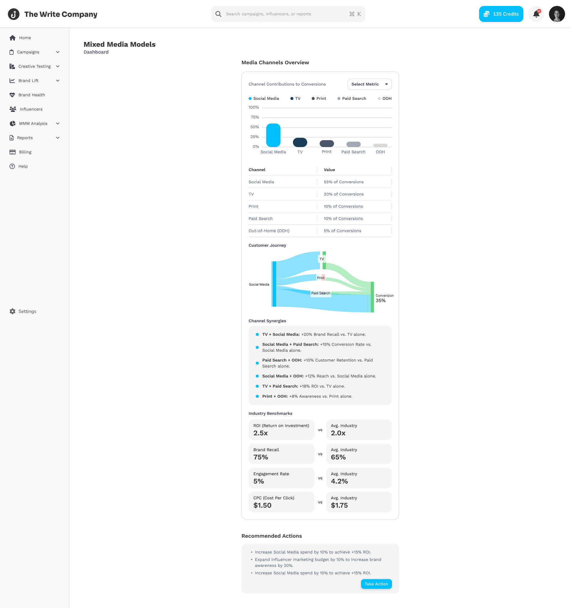

# Mixed Media Modeling (MMM) Implementation Plan

## Overview

This document outlines the implementation plan for the Mixed Media Modeling features, which allow users to analyze, visualize, and optimize their marketing spend across multiple channels. The implementation will leverage existing open-source MMM frameworks while providing a custom UI and integration layer.

## Figma Design Specifications

### 1. Channel Budget Allocation (Weightings Tool)

#### UI Components

- **Card Layout**: White background with rounded corners and subtle shadow
- **Header**: "Channel Budget Allocation" with explanatory text
- **Attribution Weight Section**:
  - Explanatory text: "Personalize Channel Credit Distribution with Interactive Sliders to Reflect Your Strategic Insights"
  - Channel-specific sliders with label, percentage value, and interactive track
  - Color-coded slider tracks (blue) that fill based on percentage
  - Channel labels aligned left with percentages aligned right
  - Warning message appears when total exceeds 100% (red background alert)

#### Channel Sliders

- **Social Media**: Default 40%, positioned at top
- **TV**: Default 30%
- **Print**: Default 25%
- **Paid Search**: Default 15%
- **OOH (Out-of-Home)**: Default 10%

#### Performance Metrics Display

- **Metrics Row**: Three key metrics displayed horizontally
  - **ROI**: "25%" with "+5%" green indicator
  - **CPA**: "$20" with "-$14" green indicator
  - **Engagement**: "15%" with "+1.4%" green indicator

#### Value Comparison Sections

- **ROI Comparison**:

  - "ROI (Return on Investment)" label
  - "Original Value: 25%" vs "Current Value: 35%"
  - "+10%" green indicator
  - Values in large, bold typography

- **CPA Comparison**:

  - "CPA (Cost Per Acquisition)" label
  - "Original Value: $20" vs "Current Value: $18"
  - "-$2" green indicator

- **Engagement Comparison**:

  - "Engagement" label
  - "Original Value: 15%" vs "Current Value: 18%"
  - "+3%" green indicator

- **Brand Lift Comparison**:
  - "Brand Lift" label
  - "Original Value: 10%" vs "Current Value: 12%"
  - "+2%" green indicator

#### Additional UI Elements

- **Recommended Allocation Button**: Blue button with lightbulb icon
- **Explanatory Text**: "Adjust Channel Weights and Instantly Visualize Changes in ROI, CPA, and Engagement"
- **Interactive Elements**: All sliders support drag interaction with immediate visual feedback

### 2. Attribution Model Comparison

#### UI Components

- **Card Layout**: White background with rounded corners
- **Header**: "Attribution Model Comparison" with explanatory text
- **Visualization Header**: "Visualizing Channel Credit Distribution Across Different Models to Help You Choose the Best Fit"

#### Model Visualization

- **Horizontal Bar Chart**:
  - Channel names aligned left (Social Media, TV, Print, Paid Search, OOH)
  - Percentage scale along top (0%, 25%, 50%, 75%, 100%)
  - Three colored bars per channel representing different attribution models:
    - Light blue: Last Touch
    - Dark blue: First Touch
    - Gray: Multi-Touch
  - Consistent color scheme throughout

#### Model Selection Controls

- **Radio Button Group**:
  - Three options: "Last Touch" (selected), "First Touch", "Multi-Touch"
  - Radio buttons with corresponding model colors
  - Positioned below visualization

#### Custom Attribution Weight Configuration

- **Channel-specific Sliders**:
  - Same design pattern as Weightings Tool
  - Social Media: 60%
  - TV: 46%
  - Print: 25%
  - Paid Search: 28%
  - OOH: 15%
  - Blue interactive slider tracks

#### AI Recommendation Section

- **Light Blue Card**: Highlighted recommendation
- **Icon**: Lightbulb/insight icon
- **Recommendation Text**: "Boost Social Media Channel Credit by 20% to Reflect Greater influence"
- **Descriptive Text**: "Increase Social Media weight by 20%"
- **Action Button**: "Take Action" button in darker blue
- **Star Icon**: For saving/favoriting recommendations

### 3. Cross-Channel Campaign Timeline

#### UI Components

- **Card Layout**: White background with rounded corners
- **Header**: "Creative Launch Timeline"
- **Subheader**: "Visualize Key Milestones and Performance Metrics for Each Creative Campaign"

#### Timeline Visualization

- **Horizontal Timeline**:
  - Day markers (Day 1, Day 3)
  - Blue circular nodes connected by lines
  - Channel-specific icons:
    - TV icon with "TV Ad" label
    - Hashtag icon with "Social Carousel" label
  - White cards for event details

#### Consistency Score Section

- **Header**: "Consistency Score" with information icon
- **Explanatory Text**: "Measures the alignment of your campaign across different channels"
- **Time Period**: "Over a 30-day period"
- **Score Display**: "85%" in large typography
- **Trend Indicator**: "+5% from last 2 weeks" in green text

#### Synergy Metrics Sections

- **Two Cards**:

  - First card: "Impact of Channel Sequences on Performance Outcomes"
  - Second card: "Insights for Seamless Collaboration"

- **Channel Sequence Impact**:

  - Three bullet points with blue dots:
    - "TV followed by Instagram: +10% Brand Recall"
    - "+10% Brand Recall: +8% Conversion Rate"
    - "YouTube followed by Facebook: +7% Engagement"

- **Hashtag Performance Table**:
  - Column headers: "Hashtag", "Engagement on Social", "Recall On OOH"
  - Five rows of hashtag data:
    - #SummerSale: +20%, +5%
    - #SpringPromo: +16%, +7%
    - #BrandAwareness: +25%, +6%
    - #Promo: +12%, +4%
    - #Engagement: +18%, +5%

#### Audience Segment Selector

- **Dropdown Menu**: Top right corner
- **Label**: "Audience Segment"

### 4. Dashboard Overview

#### UI Components

- **Card Layout**: White background with rounded corners
- **Header**: "Media Channels Overview"
- **Dropdown**: "Select Metric" selector

#### Channel Contribution Visualization

- **Bar Chart**:
  - Color-coded bars for each channel:
    - Social Media: Blue (tallest)
    - TV: Dark blue
    - Print: Medium blue
    - Paid Search: Light blue
    - OOH: Lightest blue
  - Percentage scale (0%, 25%, 50%, 75%, 100%)
  - Channel labels below bars

#### Value Table

- **Two-column Table**:
  - Channel names in left column
  - Contribution values in right column:
    - Social Media: 55% of Conversions
    - TV: 20% of Conversions
    - Print: 10% of Conversions
    - Paid Search: 10% of Conversions
    - OOH: 5% of Conversions

#### Customer Journey Visualization

- **Sankey Diagram**:
  - Flow from channels (left) to conversion (right)
  - Width of flows proportional to contribution
  - Channel-specific colors matching the bar chart
  - "Conversion: 35%" label at right endpoint
  - Channel labels embedded in diagram

#### Channel Synergies Section

- **Bullet List**:
  - Six synergy items with blue dot indicators:
    - "TV + Social Media: +20% Brand Recall vs. TV alone"
    - "Social Media + Paid Search: +15% Conversion Rate
    - "Paid Search + OOH: +10% Customer Retention
    - "Social Media + OOH: +12% Reach
    - "TV + Paid Search: +18% ROI
    - "Print + OOH: +8% Awareness"

#### Industry Benchmarks Section

- **Comparison Layout**:
  - Four metrics compared against industry averages:
    - ROI: 2.5x vs Industry 2.0x
    - Brand Recall: 75% vs Industry 65%
    - Engagement Rate: 5% vs Industry 4.2%
    - CPC: $1.50 vs Industry $1.75
  - "vs" label between each comparison
  - Values displayed in large typography

#### Recommended Actions Section

- **Action List**:
  - Bulleted recommendations with arrow icons:
    - "Increase Social Media spend by 10% to achieve +15% ROI"
    - "Expand influencer marketing budget by 10% to increase brand awareness by 20%"
    - "Increase Social Media spend by 10% to achieve +15% ROI" (repeated)
  - "Take Action" button in blue

## MMM Model Comparison

| Model              | Developer | Language   | Key Features                                                                                                                                                       | Strengths                                                                                                                           | Limitations                                                                                | Integration Complexity |
| ------------------ | --------- | ---------- | ------------------------------------------------------------------------------------------------------------------------------------------------------------------ | ----------------------------------------------------------------------------------------------------------------------------------- | ------------------------------------------------------------------------------------------ | ---------------------- |
| **LightweightMMM** | Google    | Python     | - Simple Bayesian MMM - Adstock & saturation effects - Basic budget allocation                                                                               | - Easy to get started - Good documentation - Lightweight implementation                                                       | - Now outdated - Limited customization - Basic modeling approach                     | Low                    |
| **Meridian**       | Google    | Python     | - Updated Bayesian MMM - Advanced feature support - Improved optimization                                                                                    | - Modern implementation - Better performance - Enhanced reporting                                                             | - Newer, less community adoption - Less established than alternatives                   | Medium                 |
| **Robyn**          | Meta      | R & Python | - Gradient-based optimization - Multiple modeling techniques - Extensive reporting                                                                           | - Comprehensive solution - Industry adoption - Strong visualization                                                           | - Complex setup - Steep learning curve - Resource intensive                          | High                   |
| **PyMC-Marketing** | PyMC Labs | Python     | - Bayesian probabilistic approach - Time-varying effects - Custom priors and likelihoods - Adstock/saturation transformations - Experiment calibration | - Scientific robustness - Uncertainty quantification - Flexible modeling - Production-ready - Docker/MLflow integration | - Requires Bayesian knowledge - More complex implementation - Steeper learning curve | Medium-High            |

### Recommended Integration Approach

Based on the comparison above, we recommend a hybrid approach:

1. **Initial Implementation**: Integrate with PyMC-Marketing for its robust Bayesian framework and production-ready features
2. **Alternative Models**: Provide adapter interfaces for Meridian and Robyn as alternative options
3. **Custom Extensions**: Develop custom features on top of these frameworks to provide unique value

### Why PyMC-Marketing as Primary Choice

PyMC-Marketing provides a comprehensive Bayesian approach to Media Mix Modeling with several key benefits:

1. **Scientific Robustness**: The Bayesian framework quantifies uncertainty in marketing channel effectiveness, giving more reliable estimates than traditional methods.

2. **Advanced Marketing Effects Modeling**:

   - Adstock Transformation: Models how marketing efforts have lingering effects over time
   - Saturation Effects: Captures diminishing returns when increasing spend on a channel
   - Time-varying Parameters: Accounts for changing effectiveness of channels over time
   - Custom Priors and Likelihoods: Incorporates domain-specific knowledge into the models

3. **Optimization Capabilities**: Includes tools for optimal budget allocation across channels based on expected ROI, with scenario planning and "what-if" analyses.

4. **Production-Ready**: Designed to be deployed in production environments with Docker, MLflow integration, and workflow orchestration.

## Core Features & Interfaces

### 1. Channel Budget Allocation (Weightings Tool)

- **Interactive Sliders Interface**
  - Personalized channel weight adjustment (Social Media, TV, Print, Paid Search, OOH)
  - Real-time percentage allocation display
  - Warning for total allocation exceeding 100%
  - Color-coded slider tracks with drag interaction
- **Performance Metrics Display**
  - ROI (Return on Investment) with percentage change
  - CPA (Cost Per Acquisition) with dollar change
  - Engagement rates with percentage change
  - Metrics displayed in horizontally aligned cards
- **Value Comparison**
  - Original vs Current value comparisons for:
    - ROI: 25% → 35% (+10%)
    - CPA: $20 → $18 (-$2)
    - Engagement: 15% → 18% (+3%)
    - Brand Lift: 10% → 12% (+2%)
  - Positive changes indicated in green

### 2. Attribution Model Comparison

- **Model Visualization**
  - Horizontal bar chart comparing attribution across channels
  - Support for multiple attribution models:
    - Last Touch (currently selected)
    - First Touch
    - Multi-Touch
    - Bayesian (from PyMC-Marketing)
    - Gradient-based (from Robyn/Meridian)
  - Color-coded bars (light blue, dark blue, gray)
- **Custom Attribution Weight Configuration**
  - Interactive sliders for channel credit distribution
  - Channel-specific percentage allocation:
    - Social Media: 60%
    - TV: 46%
    - Print: 25%
    - Paid Search: 28%
    - OOH: 15%
  - Radio button group for model selection
- **AI Recommendations**
  - Actionable insights (e.g., "Boost Social Media Channel Credit by 20%")
  - Implementation option with "Take Action" button
  - Confidence intervals for recommendations (leveraging Bayesian models)
  - Light blue card with icon for highlighted recommendations

### 3. Cross-Channel Campaign Timeline

- **Creative Launch Timeline**
  - Visual timeline of campaign elements (TV Ad, Social Carousel)
  - Day markers and milestone visualization
  - Blue circular nodes connected by horizontal lines
  - Channel-specific icons and labels
- **Consistency Score Tracking**
  - Overall consistency score (85%)
  - Historical comparison (+5% from last 2 weeks)
  - 30-day measurement period
  - Information icon with explanatory tooltip
- **Synergy Metrics**
  - Channel sequence impact analysis:
    - TV followed by Instagram: +10% Brand Recall
    - Brand Recall followed by conversion: +8% Conversion Rate
    - YouTube followed by Facebook: +7% Engagement
  - Bullet points with blue dot indicators
- **Hashtag Performance**
  - Cross-channel hashtag effectiveness
  - Metrics for engagement on social and recall on OOH
  - Tabular format with three columns

### 4. Dashboard Overview

- **Media Channels Overview**
  - Channel contributions to conversions (visualization + table)
  - Color-coded bar chart
  - Metric selector dropdown
  - Detailed breakdown of value by channel:
    - Social Media: 55% of Conversions
    - TV: 20% of Conversions
    - Print: 10% of Conversions
    - Paid Search: 10% of Conversions
    - OOH: 5% of Conversions
- **Customer Journey Visualization**
  - Sankey diagram showing flow between channels to conversion
  - Conversion rate display (35%)
  - Width of flows proportional to contribution
  - Channel-specific colors consistent with bar chart
- **Channel Synergies**
  - Paired channel performance improvements:
    - TV + Social Media: +20% Brand Recall vs. TV alone
    - Social Media + Paid Search: +15% Conversion Rate
    - Paid Search + OOH: +10% Customer Retention
    - Social Media + OOH: +12% Reach
    - TV + Paid Search: +18% ROI
    - Print + OOH: +8% Awareness
  - Consistent bullet point format
- **Industry Benchmarks**
  - Comparative performance metrics:
    - ROI: 2.5x vs. Industry Avg. 2.0x
    - Brand Recall: 75% vs. Industry Avg. 65%
    - Engagement Rate: 5% vs. Industry Avg. 4.2%
    - CPC: $1.50 vs. Industry Avg. $1.75
  - "vs" label between comparisons
- **Recommended Actions**
  - AI-generated optimization suggestions:
    - Increase Social Media spend by 10% to achieve +15% ROI
    - Expand influencer marketing budget by 10% for +20% brand awareness
  - Model-specific recommendations with uncertainty ranges
  - "Take Action" button for implementing suggestions

## Technical Requirements

### 1. Data Integration

- **Required Data Sources**

  - Media spend data by channel
  - Performance metrics (conversions, revenue, cost)
  - Campaign timeline information
  - Industry benchmark datasets
  - Creative asset metadata
  - Lift test results (for model calibration)
  - Time series data of KPIs (at least 2-3 years for proper seasonality capture)
  - Control variables (economic indicators, competitor activities, seasonal factors)
  - External factors and geographic data if applicable

- **APIs & Connectors**
  - Facebook Marketing API
  - Google Ads API
  - Google Analytics API
  - Custom API for TV/OOH/Print data import
  - Data export to PyMC-Marketing, Meridian or Robyn

### 2. Backend Requirements

- **Core MMM Framework Integration**

  - Python wrapper for PyMC-Marketing (primary)
  - Optional adapters for Meridian and Robyn
  - Model configuration management
  - Result caching and storage

- **Statistical Models**

  - Multi-touch attribution algorithm
  - Marketing mix modeling algorithm
  - Bayesian inference engine for causal analysis
  - Forecasting algorithms for scenario planning
  - Adstock and saturation effect modeling
  - Time-varying intercepts and media contributions
  - Gaussian process approximation methods

- **Data Processing**
  - Data normalization and cleansing pipelines
  - Channel classification system
  - Incremental contribution calculation
  - Seasonality adjustment
  - Anomaly detection and handling
  - Data preprocessing for PyMC-Marketing format requirements

### 3. Frontend Components

- **React Components**

  - SliderControl.tsx (for weight adjustments)
    - Props: value, min, max, onChange, color, label
    - Interactive track with draggable thumb
    - Real-time value display
  - PerformanceMetricsCard.tsx
    - Props: title, value, change, isPositive
    - Conditional styling for positive/negative changes
  - ChannelAllocationTable.tsx
    - Props: channels, values, onChange
    - Warning display when sum > 100%
  - AttributionModelSelector.tsx
    - Props: models, selectedModel, onSelect
    - Radio button group with color-coded options
  - TimelineVisualizer.tsx
    - Props: events, days, channels
    - Horizontal timeline with nodes and labels
  - SynergyMetricsDisplay.tsx
    - Props: synergies, metricType
    - Bullet list with formatted values
  - CustomerJourneySankey.tsx
    - Props: flowData, colorMap, width, height
    - Interactive flow diagram with tooltips
  - BenchmarkComparison.tsx
    - Props: actual, benchmark, metricName, unit
    - Side-by-side comparison with vs label
  - ModelComparisonView.tsx (to compare different MMM frameworks)
    - Props: modelResults, selectedMetrics
    - Tabbed interface for model comparison
  - UncertaintyVisualizer.tsx (for displaying Bayesian confidence intervals)
    - Props: meanValue, confidenceIntervals, percentiles
    - Error bands with customizable opacity

- **Visualization Libraries**
  - D3.js for custom visualizations
  - Chart.js for standard charts
  - Nivo for heatmaps and specialized visualizations
  - react-flow for Sankey diagrams
  - Confidence interval visualizations

### 4. State Management

- **Data Models**

  - Channel configuration
  - Attribution model settings
  - User preferences
  - Scenario comparison
  - Model selection and configuration

- **API Integration**
  - Real-time updates for impact analysis
  - Batch processing for historical analysis
  - Progress indicators for long-running calculations
  - Asynchronous model training and inference
  - API wrapper to interface with existing systems

## Integration Architecture

### 1. Model Abstraction Layer

- Common interface for all MMM models
- Standardized input/output formats
- Model-specific adapters
- Configuration management

### 2. Execution Engine

- Model training orchestration
- Inference pipeline
- Caching and optimization
- Distributed computing support for resource-intensive models

### 3. Data Pipeline

- Standardized data ingestion
- Preprocessing for model requirements
- Feature engineering customized for each model
- Validation and quality checks

### 4. Result Interpretation

- Unified result format
- Confidence interval standardization
- Model comparison metrics
- Performance evaluation

## PyMC-Marketing Integration Strategy

### 1. Data Preparation

- Format channel spend data, KPI metrics, and control variables
- Ensure minimum 2-3 years of data for proper seasonality modeling
- Prepare lift test results for model calibration
- Structure data according to PyMC-Marketing requirements

### 2. Technical Implementation

- Set up Python environment with PyMC dependencies
- Create data preprocessing pipeline for Bayesian modeling
- Develop API wrapper to connect with existing dashboard components
- Build custom visualization components for uncertainty displays
- Configure inference pipeline for optimal performance

### 3. Production Deployment

- Implement container-based deployment using Docker
- Set up experiment tracking with MLflow
- Create automated pipelines for regular model updates
- Integrate with existing monitoring system
- Establish automated testing and validation procedures

## User Experience Flow

### 1. Dashboard Overview

- User enters the MMM section from the main navigation
- Dashboard view shows high-level metrics and channel performance
- User can select time periods and campaigns for analysis
- Option to select preferred MMM model (PyMC-Marketing, Meridian, or Robyn)

### 2. Model Exploration & Adjustment

- User navigates to attribution model comparison screen
- Compares different attribution models for insights
- Selects preferred model for deeper analysis
- Can compare results between different MMM frameworks

### 3. Channel Optimization

- User accesses weightings tool
- Adjusts channel allocations to see impact on performance metrics
- Saves optimized scenarios for implementation
- Views uncertainty ranges for predictions

### 4. Campaign Planning

- User views cross-channel timeline
- Analyzes synergy effects between channels
- Plans new campaign sequences based on insights
- Integrates with campaign execution tools

## Implementation Roadmap

### Phase 1: Core Infrastructure & PyMC-Marketing Integration

- Set up Python environment and dependencies
- Implement PyMC-Marketing wrapper
- Basic data pipeline and processing
- Simple dashboard with key metrics

### Phase 2: UI Foundation & Attribution Modeling

- Implementation of core UI components
- Integration of attribution models
- Model comparison visualization
- Custom weight configuration interface

### Phase 3: Advanced Features & Alternative Models

- Interactive weightings tool with sliders
- Real-time impact calculation
- Scenario saving and comparison
- Optional integration with Meridian or Robyn

### Phase 4: Cross-Channel Analysis & Optimization

- Cross-channel timeline visualization
- Synergy metrics calculation and display
- AI-powered recommendations
- Industry benchmarking
- Budget optimization engine

### Phase 5: Refinement & Extended Capabilities

- UX polish and performance optimization
- Enhanced analytics and export capabilities
- Advanced AI recommendations
- User feedback incorporation
- Model comparison tools and evaluation metrics

## Credit Usage & Plan Tier Integration

| Feature                | Credit Cost | Pay-As-You-Go | Essential | Professional | Advanced |
| ---------------------- | ----------- | ------------- | --------- | ------------ | -------- |
| Basic MMM Dashboard    | 10 credits  | ❌            | ❌        | ✅           | ✅       |
| Attribution Models     | 25 credits  | ❌            | ❌        | ✅           | ✅       |
| Budget Allocation Tool | 30 credits  | ❌            | ❌        | ❌           | ✅       |
| Cross-Channel Analysis | 40 credits  | ❌            | ❌        | ❌           | ✅       |
| AI Recommendations     | 50 credits  | ❌            | ❌        | ❌           | ✅       |
| Industry Benchmarking  | 35 credits  | ❌            | ❌        | ❌           | ✅       |
| Alternative MMM Models | 45 credits  | ❌            | ❌        | ❌           | ✅       |
| Model Comparison Tools | 40 credits  | ❌            | ❌        | ❌           | ✅       |

## Success Metrics

- **User Engagement**: Average time spent in MMM tools
- **Implementation Rate**: Percentage of recommended actions taken
- **Budget Efficiency**: Improvements in ROI after MMM-guided optimizations
- **User Satisfaction**: Feedback ratings on MMM features
- **Attribution Clarity**: Reduction in "unknown" attribution percentage
- **Model Accuracy**: Performance against holdout datasets
- **Decision Confidence**: User survey on confidence in model-based decisions

## Appendix: MMM Model Details

### PyMC-Marketing

- **Key Capabilities**:

  - Bayesian modeling approach with robust uncertainty handling
  - Custom priors and likelihoods for incorporating domain-specific knowledge
  - Advanced adstock transformation for modeling carry-over effects from past marketing
  - Saturation effects modeling to capture diminishing returns on media investments
  - Time-varying intercept using Gaussian process approximation
  - Time-varying media contribution to model evolving channel effectiveness
  - Experiment calibration with lift tests to validate model predictions
  - Comprehensive visualization and diagnostics
  - Budget optimization for maximizing ROI
  - Scenario planning with "what-if" analyses

- **Integration Requirements**:

  - Python environment with PyMC dependencies
  - Data preprocessing for Bayesian modeling
  - Docker container for production deployment
  - MLflow for experiment tracking
  - Time series data with at least 2-3 years history
  - Marketing spend data across all channels
  - Control variables (economic indicators, seasonal factors)
  - Optional lift test results for model calibration

- **Benefits Over Traditional Approaches**:
  - Scientific robustness through Bayesian methodology
  - Quantification of uncertainty in channel effectiveness estimates
  - More accurate modeling of marketing effects over time
  - Better handling of data sparsity and noise
  - Improved budget allocation recommendations
  - Integration with experimental results

### Meridian

- **Key Capabilities**:

  - Updated version of Google's MMM framework
  - Advanced feature engineering
  - Improved optimization algorithms
  - Better handling of data quality issues

- **Integration Requirements**:
  - Python environment with TensorFlow
  - Structured data format
  - Model export/import capabilities

### Robyn

- **Key Capabilities**:

  - Multi-objective optimization
  - Automated hyperparameter tuning
  - Extensive reporting and visualization
  - Available in both R and Python

- **Integration Requirements**:
  - R environment (primary) or Python with rpy2
  - Complex data formatting requirements
  - Higher computational resources
