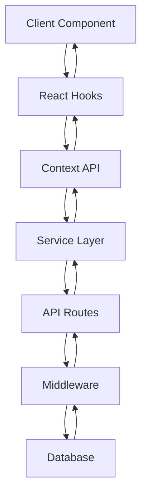

# Module Architecture Guide

## Overview

This document provides a comprehensive overview of the application's module structure, interactions, and architectural decisions. It serves as a high-level guide for understanding how different parts of the system work together.

## Core Module Structure

The application follows a modular architecture with clear separation of concerns:

```
src/
├── app/                # Next.js App Router pages and API routes
├── components/         # React components organized by purpose
├── hooks/              # Custom React hooks
├── contexts/           # React context providers
├── lib/                # Utility libraries and core functionality
├── middlewares/        # Request processing middleware
├── services/           # External service integrations
├── types/              # TypeScript type definitions
└── utils/              # Helper functions and utilities
```

## Module Interactions

### Data Flow

1. **Client Request Flow:**

   - User interactions trigger component actions
   - Components use hooks/contexts to access state
   - API requests are made through services
   - Responses update state via context providers

2. **Server Request Flow:**
   - API routes receive requests
   - Middleware processes requests (auth, validation)
   - Database operations occur via service layer
   - Response is formatted and returned



## Key Architectural Patterns

### Component Architecture

Components are organized into three main categories:

1. **UI Components** (`/components/ui/`):

   - Pure presentation components
   - No business logic
   - Highly reusable
   - Styled with Tailwind CSS

2. **Feature Components** (`/components/features/`):

   - Implement specific business capabilities
   - Can contain business logic
   - Typically domain-specific
   - May manage local state

3. **Layout Components** (`/components/layouts/`):
   - Define page structure
   - Handle responsive behavior
   - Implement navigation patterns
   - Provide consistent UI containers

### Middleware Pattern

API middleware follows a structured pattern for consistent request handling:

1. **Authentication** - Verifies user identity
2. **Validation** - Ensures request data conforms to expected schema
3. **Authorization** - Checks user permissions
4. **Error Handling** - Provides standardized error responses

Middleware components can be composed for different API routes:

```typescript
// Example composition
const campaignRouter = compose(
  withAuth,
  withValidation(campaignSchema),
  withErrorHandling,
  campaignController
);
```

### State Management

The application uses a combination of state management approaches:

1. **React Context** - For global application state
2. **React Query** - For server state and caching
3. **Component State** - For local UI state
4. **URL State** - For shareable/bookmarkable state

## Module Details

### API Routes (`/app/api/`)

API routes follow a structured pattern:

- Route handlers in appropriate directories
- Schema validation using Zod
- Consistent error handling
- Clear separation of validation and business logic

Example route structure:

```
api/
├── auth/
│   └── [...auth0]/
├── campaigns/
│   ├── route.ts          # Main CRUD operations
│   ├── search/
│   │   └── route.ts      # Search functionality
│   └── [id]/
│       └── route.ts      # Single campaign operations
└── users/
    └── route.ts
```

### Middleware (`/middlewares/`)

The middleware directory contains reusable middleware functions:

- **API Middleware** - Processing HTTP requests
- **Auth Middleware** - Authentication and authorization
- **Validation Middleware** - Request data validation

These middleware functions follow a consistent pattern and can be composed together.

### Services (`/services/`)

Services handle external integrations and core business logic:

- **API Services** - Internal API clients
- **External Services** - Third-party API integrations
- **Data Services** - Database operations and transactions

Services are designed to be testable and mockable.

## Best Practices

1. **Component Composition** - Prefer composition over inheritance
2. **Single Responsibility** - Each module should have one reason to change
3. **Dependency Injection** - Pass dependencies rather than importing directly
4. **Consistent Error Handling** - Use standardized error patterns
5. **Type Safety** - Leverage TypeScript for type definitions

## Common Patterns

### Error Handling

```typescript
try {
  // Operation that might fail
} catch (error) {
  // Standard error logging
  logger.error(
    'Operation failed',
    { context: 'relevant context' },
    error instanceof Error ? error : new Error(String(error))
  );

  // Standard error response
  return {
    success: false,
    error: 'User-friendly error message',
    details: process.env.NODE_ENV === 'development' ? error.message : undefined,
  };
}
```

### Data Validation

```typescript
const schema = z.object({
  name: z.string().min(1, 'Name is required'),
  email: z.string().email('Valid email is required'),
});

const validationResult = schema.safeParse(data);

if (!validationResult.success) {
  return handleValidationError(validationResult.error);
}

// Use validatedData safely
const validatedData = validationResult.data;
```

## Module Interdependencies

To maintain a clean architecture, these dependencies are enforced:

- UI Components should not depend on Features
- Features can depend on UI Components
- Services should not depend on Components
- All modules can depend on Types and Utils

## Conclusion

This architectural approach ensures:

1. **Scalability** - New features can be added without disrupting existing ones
2. **Maintainability** - Code is organized in a predictable way
3. **Testability** - Components and services can be tested in isolation
4. **Developer Experience** - Clear patterns make onboarding easier
