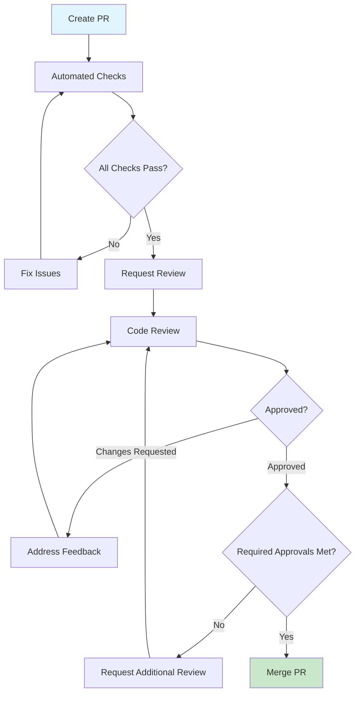

# Contribution Guidelines & Code Review

**Last Updated:** 23rd May 2025  
**Target Audience:** Developers with 2+ years experience  
**Collaboration Standard:** Open source contribution best practices

---

## 🤝 Overview

This section provides comprehensive guidelines for contributing to our influencer marketing platform, ensuring high-quality code, consistent standards, and effective collaboration. Designed for both internal team members and external contributors.

### **What You'll Find**

- Complete contribution workflow and guidelines
- Code review standards and best practices
- Pull request templates and procedures
- Quality assurance and testing requirements

---

## 📋 Contribution Process

### **✅ Getting Started**

#### **Before Contributing**

- [ ] **Read Documentation** - Understand the codebase and architecture
- [ ] **Set Up Environment** - Follow [Developer Setup](../getting-started/developer-setup.md)
- [ ] **Understand Standards** - Review [Code Standards](../standards/code-standards.md)
- [ ] **Check Existing Issues** - Look for relevant issues or feature requests

#### **Contribution Types**

- **🐛 Bug Fixes** - Resolving issues and defects
- **✨ Feature Development** - Adding new functionality
- **📚 Documentation** - Improving documentation and guides
- **🎨 UI/UX Improvements** - Enhancing user interface and experience
- **⚡ Performance** - Optimizing performance and efficiency
- **🔒 Security** - Addressing security vulnerabilities

---

## 🎯 Quick Contribution Guide

| Contribution Type | Estimated Time       | Required Approvals | Key Requirements                  |
| ----------------- | -------------------- | ------------------ | --------------------------------- |
| **Bug Fix**       | 1-3 hours            | 1 reviewer         | Test coverage, reproduction steps |
| **Small Feature** | 1-2 days             | 1 reviewer         | Tests, documentation              |
| **Major Feature** | 1-2 weeks            | 2 reviewers        | Design doc, comprehensive tests   |
| **Documentation** | 30 minutes - 2 hours | 1 reviewer         | Accuracy, clarity                 |

---

## 🚀 Contribution Workflow

### **1. Planning & Preparation**

#### **Issue Creation & Discussion**

```markdown
# Feature Request Template

## 🎯 Objective

Brief description of what you want to achieve

## 💡 Proposed Solution

How you plan to implement this feature

## 🧪 Testing Plan

How you will test the implementation

## 📋 Acceptance Criteria

- [ ] Criterion 1
- [ ] Criterion 2
- [ ] Criterion 3

## 🔗 Related Issues

Links to related issues or dependencies
```

#### **Branch Strategy**

```bash
# Create feature branch from main
git checkout main
git pull origin main
git checkout -b feat/your-feature-name

# For bug fixes
git checkout -b fix/bug-description

# For documentation
git checkout -b docs/documentation-improvement
```

### **2. Development Process**

#### **Code Development Standards**

```typescript
// 1. Type-first development
interface UserPreferences {
  theme: 'light' | 'dark';
  notifications: boolean;
  language: string;
}

// 2. Comprehensive error handling
export async function updateUserPreferences(
  userId: string,
  preferences: UserPreferences
): Promise<User> {
  try {
    // Validate input
    validateUserPreferences(preferences);

    // Update preferences
    const updatedUser = await userService.updatePreferences(userId, preferences);

    // Log success
    logger.info('User preferences updated', { userId, preferences });

    return updatedUser;
  } catch (error) {
    logger.error('Failed to update user preferences', { userId, error });
    throw new UserPreferencesError('Failed to update preferences');
  }
}

// 3. Comprehensive testing
describe('updateUserPreferences', () => {
  it('should update user preferences successfully', async () => {
    // Test implementation
  });

  it('should handle invalid input gracefully', async () => {
    // Error handling test
  });
});
```

#### **Commit Standards**

```bash
# Conventional commit format
feat(auth): add two-factor authentication support
fix(ui): resolve button alignment issue in campaign wizard
docs(api): update authentication endpoint documentation
test(campaigns): add integration tests for campaign creation
refactor(database): optimize user query performance

# Commit message structure
# type(scope): description
#
# Longer description if needed
#
# Breaking changes (if any)
# Fixes #issue-number
```

---

## 🔍 Code Review Guidelines

### **Pull Request Standards**

#### **PR Template**

```markdown
## 📋 Description

Brief description of changes and motivation

## 🔄 Type of Change

- [ ] Bug fix (non-breaking change that fixes an issue)
- [ ] New feature (non-breaking change that adds functionality)
- [ ] Breaking change (fix or feature that would cause existing functionality to not work as expected)
- [ ] Documentation update

## 🧪 Testing

- [ ] Unit tests pass
- [ ] Integration tests pass
- [ ] E2E tests pass (if applicable)
- [ ] Manual testing completed

## 📸 Screenshots (if applicable)

Before and after screenshots for UI changes

## 📋 Checklist

- [ ] My code follows the style guidelines
- [ ] I have performed a self-review of my code
- [ ] I have commented my code, particularly in hard-to-understand areas
- [ ] I have made corresponding changes to the documentation
- [ ] My changes generate no new warnings
- [ ] I have added tests that prove my fix is effective or that my feature works
- [ ] New and existing unit tests pass locally with my changes

## 🔗 Related Issues

Fixes #issue-number
```

### **Review Process**

#### **Reviewer Responsibilities**

```typescript
// ✅ Good review practices

// 1. Check functionality
// Does this solve the intended problem?
// Are edge cases handled?

// 2. Code quality review
// Is the code readable and maintainable?
// Are there any code smells?

// 3. Performance considerations
// Could this impact performance?
// Are there more efficient approaches?

// 4. Security review
// Does this introduce security vulnerabilities?
// Are inputs properly validated?

// 5. Test coverage
// Are the changes adequately tested?
// Do tests cover edge cases?
```

#### **Review Comments Standards**

```typescript
// ✅ Constructive feedback
// Consider using a Map here for O(1) lookup instead of Array.find()
// This will improve performance when dealing with large user lists

// Suggestion: Add error handling for the case where the campaign is not found
// This could prevent runtime errors in production

// ✅ Positive reinforcement
// Great error handling implementation! This will make debugging much easier

// ❌ Avoid vague or negative comments
// This doesn't look right
// This is wrong, fix it
```

### **Review Approval Process**

#### **Approval Requirements**

| Change Type         | Required Approvals     | Special Requirements       |
| ------------------- | ---------------------- | -------------------------- |
| **Bug Fix**         | 1 team member          | Tests demonstrating fix    |
| **Feature**         | 1 senior developer     | Documentation updated      |
| **Breaking Change** | 2 senior developers    | Migration guide provided   |
| **Security Fix**    | 1 security team member | Security impact assessment |



---

## 🧪 Quality Assurance Requirements

### **Testing Standards**

#### **Required Test Coverage**

```typescript
// Unit tests for all new functions
describe('calculateCampaignBudget', () => {
  it('should calculate budget correctly for standard campaign', () => {
    const result = calculateCampaignBudget({
      influencerCount: 5,
      budgetPerInfluencer: 1000,
      platformFee: 0.1,
    });

    expect(result.totalBudget).toBe(5500);
    expect(result.platformFee).toBe(500);
  });

  it('should handle edge case with zero influencers', () => {
    const result = calculateCampaignBudget({
      influencerCount: 0,
      budgetPerInfluencer: 1000,
      platformFee: 0.1,
    });

    expect(result.totalBudget).toBe(0);
  });
});

// Integration tests for API endpoints
describe('POST /api/campaigns', () => {
  it('should create campaign successfully', async () => {
    const response = await request(app).post('/api/campaigns').send(validCampaignData).expect(201);

    expect(response.body.campaign.id).toBeDefined();
  });
});
```

#### **Quality Gates**

```bash
# Pre-commit quality checks
npm run lint           # ESLint validation
npm run type-check     # TypeScript compilation
npm run test:unit      # Unit test execution
npm run test:security  # Security vulnerability scan

# Pre-merge quality checks
npm run test:integration  # Integration test execution
npm run test:e2e         # End-to-end test execution
npm run build            # Production build validation
```

---

## 📚 Documentation Requirements

### **Code Documentation Standards**

#### **Function Documentation**

````typescript
/**
 * Creates a new brand lift study with the provided configuration
 *
 * @param studyConfig - Configuration object for the study
 * @param studyConfig.campaignId - ID of the associated campaign
 * @param studyConfig.questions - Array of survey questions
 * @param studyConfig.targetAudience - Target demographic for the study
 * @returns Promise<BrandLiftStudy> - The created study object
 *
 * @throws {ValidationError} When study configuration is invalid
 * @throws {CampaignNotFoundError} When campaign ID doesn't exist
 *
 * @example
 * ```typescript
 * const study = await createBrandLiftStudy({
 *   campaignId: 'camp_123',
 *   questions: [
 *     { text: 'How familiar are you with our brand?', type: 'scale' }
 *   ],
 *   targetAudience: { ageRange: [18, 35], location: 'US' }
 * });
 * ```
 */
export async function createBrandLiftStudy(
  studyConfig: BrandLiftStudyConfig
): Promise<BrandLiftStudy> {
  // Implementation
}
````

#### **Component Documentation**

````typescript
interface ButtonProps {
  /** Button content */
  children: React.ReactNode;
  /** Button style variant */
  variant?: 'primary' | 'secondary' | 'outline';
  /** Button size */
  size?: 'sm' | 'md' | 'lg';
  /** Whether button is disabled */
  disabled?: boolean;
  /** Click handler */
  onClick?: (event: React.MouseEvent) => void;
  /** Additional CSS classes */
  className?: string;
}

/**
 * Primary button component used throughout the application
 *
 * @example
 * ```tsx
 * <Button variant="primary" size="md" onClick={handleClick}>
 *   Create Campaign
 * </Button>
 * ```
 */
export const Button: React.FC<ButtonProps> = ({
  children,
  variant = 'primary',
  size = 'md',
  disabled = false,
  onClick,
  className,
  ...props
}) => {
  // Component implementation
};
````

---

## 🔒 Security Considerations

### **Security Review Checklist**

#### **Input Validation**

- [ ] **User Input Sanitized** - All user inputs properly validated and sanitized
- [ ] **SQL Injection Protection** - Using parameterized queries (Prisma ORM)
- [ ] **XSS Prevention** - Proper output encoding and CSP headers
- [ ] **Authentication Required** - Protected endpoints require authentication

#### **Data Protection**

- [ ] **Sensitive Data Handling** - No secrets in code or logs
- [ ] **GDPR Compliance** - User data handling follows privacy regulations
- [ ] **Access Control** - Proper authorization checks implemented
- [ ] **Audit Logging** - Security-relevant actions are logged

```typescript
// ✅ Good security practices
export async function updateCampaign(
  campaignId: string,
  updates: CampaignUpdateData,
  userId: string
) {
  // 1. Validate input
  const validatedUpdates = campaignUpdateSchema.parse(updates);

  // 2. Check authorization
  const campaign = await getCampaignByIdAndUserId(campaignId, userId);
  if (!campaign) {
    throw new UnauthorizedError('Campaign not found or access denied');
  }

  // 3. Sanitize data
  const sanitizedUpdates = sanitizeCampaignData(validatedUpdates);

  // 4. Audit log
  logger.info('Campaign update initiated', {
    campaignId,
    userId,
    updateFields: Object.keys(sanitizedUpdates),
  });

  // 5. Update campaign
  return await prisma.campaign.update({
    where: { id: campaignId },
    data: sanitizedUpdates,
  });
}
```

---

## 🚀 Getting Help & Support

### **Communication Channels**

#### **Internal Team**

- **Slack Channels**:
  - `#dev-help` - General development questions
  - `#code-review` - Code review discussions
  - `#architecture` - Architecture and design decisions
  - `#security` - Security-related questions

#### **External Contributors**

- **GitHub Discussions** - Feature requests and general questions
- **GitHub Issues** - Bug reports and specific problems
- **Email** - Security vulnerabilities: security@justify.com

### **Mentorship & Pair Programming**

#### **New Contributor Support**

```markdown
# New Contributor Checklist

- [ ] Welcome call with team lead
- [ ] Codebase walkthrough session
- [ ] First contribution with mentorship
- [ ] Code review training
- [ ] Access to team communication channels

# Pair Programming Sessions

- **Weekly Office Hours** - Tuesdays 2-4 PM GMT
- **On-Demand Help** - Available via Slack
- **Code Review Sessions** - Fridays 10-11 AM GMT
```

---

## 📊 Contribution Recognition

### **Contributor Acknowledgment**

#### **Recognition Program**

- **Monthly Contributors** - Highlighted in team updates
- **Documentation Champions** - Special recognition for documentation improvements
- **Bug Hunters** - Recognition for finding and fixing critical issues
- **Feature Champions** - Recognition for successful feature deliveries

#### **Contribution Metrics**

```typescript
// Tracking contribution impact
interface ContributorMetrics {
  pullRequestsMerged: number;
  linesOfCodeContributed: number;
  bugsFixed: number;
  featuresDelivered: number;
  documentationImprovements: number;
  codeReviewsProvided: number;
  testCoverageImprovement: number;
}
```

---

## 🔄 Continuous Improvement

### **Feedback & Process Enhancement**

#### **Regular Process Review**

- **Monthly Retrospectives** - Team process improvement discussions
- **Quarterly Guidelines Review** - Update contribution guidelines
- **Annual Workflow Assessment** - Major process improvements
- **Continuous Feedback** - Ongoing process refinement

#### **Contribution Analytics**

```bash
# Contribution analytics commands
npm run analytics:contributions  # Generate contribution reports
npm run analytics:quality       # Code quality metrics
npm run analytics:velocity      # Development velocity tracking
```

---

_This contribution documentation follows open source best practices and Silicon Valley scale-up standards for collaborative development._

**Contribution Process Rating: 9.5/10** ⭐  
**Team Collaboration: Excellent** ✅  
**Last Review: 23rd May 2025** 🎯
