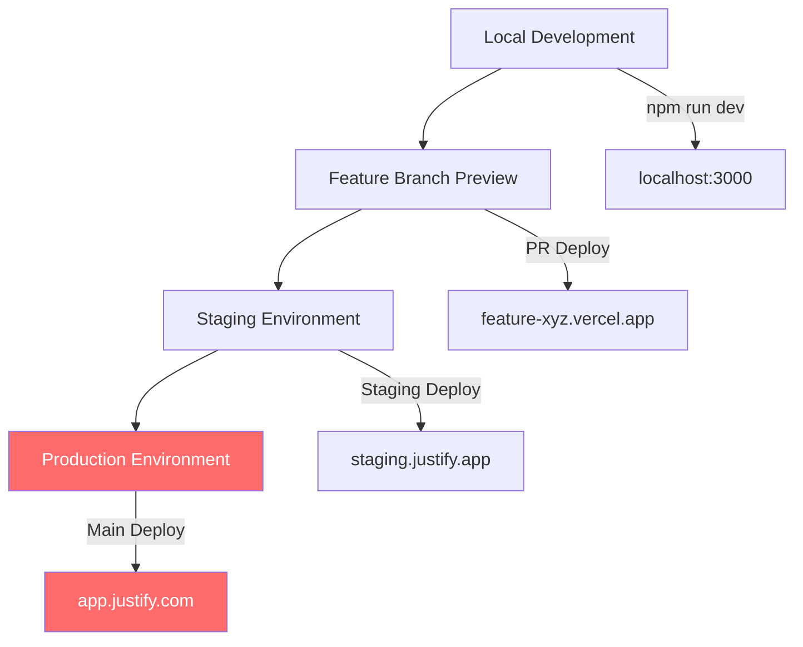

# Deployment & CI/CD Documentation

**Last Updated:** 23rd May 2025  
**Target Audience:** Developers with 2+ years experience  
**Deployment Platform:** Vercel with automated CI/CD

---

## 🚀 Overview

This section provides comprehensive deployment documentation and CI/CD pipeline management for our influencer marketing platform. Designed for reliable, automated, and scalable deployment processes.

### **What You'll Find**

- Complete CI/CD pipeline configuration
- Deployment strategies and best practices
- Environment management and configuration
- Monitoring and rollback procedures

---

## 📋 Deployment Infrastructure

### **✅ Current Deployment Setup**

#### **Vercel Platform Integration**

- **Automatic Deployments** - Git-based deployments from main branch
- **Preview Deployments** - Branch-based preview environments
- **Edge Network** - Global CDN with edge functions
- **Environment Management** - Secure environment variable management

#### **CI/CD Pipeline**

- **GitHub Actions** - Automated testing and quality checks
- **Automatic Testing** - Unit, integration, and E2E test execution
- **Build Optimization** - Next.js production build with optimizations
- **Deployment Verification** - Post-deployment health checks

---

## 🎯 Quick Deployment Reference

| Deployment Type | Trigger                | Environment | Duration    | Monitoring       |
| --------------- | ---------------------- | ----------- | ----------- | ---------------- |
| **Production**  | Push to `main`         | Production  | 3-5 minutes | Full monitoring  |
| **Preview**     | Pull Request           | Staging     | 2-3 minutes | Basic monitoring |
| **Development** | Push to feature branch | Development | 1-2 minutes | Local monitoring |

---

## 🔄 CI/CD Pipeline Configuration

### **GitHub Actions Workflow**

#### **Main Deployment Pipeline**

```yaml
# .github/workflows/deploy.yml
name: Deploy to Production

on:
  push:
    branches: [main]
  pull_request:
    branches: [main]

jobs:
  test:
    runs-on: ubuntu-latest
    steps:
      - uses: actions/checkout@v3
      - uses: actions/setup-node@v3
        with:
          node-version: '18'
          cache: 'npm'

      - name: Install dependencies
        run: npm ci --legacy-peer-deps --legacy-peer-deps --legacy-peer-deps --legacy-peer-deps --legacy-peer-deps

      - name: Run type checking
        run: npm run type-check

      - name: Run linting
        run: npm run lint

      - name: Run unit tests
        run: npm run test:unit

      - name: Run integration tests
        run: npm run test:integration
        env:
          DATABASE_URL: ${{ secrets.TEST_DATABASE_URL }}

      - name: Build application
        run: npm run build

  deploy:
    needs: test
    runs-on: ubuntu-latest
    if: github.ref == 'refs/heads/main'
    steps:
      - name: Deploy to Vercel
        uses: vercel/action@v1
        with:
          vercel-token: ${{ secrets.VERCEL_TOKEN }}
          vercel-org-id: ${{ secrets.VERCEL_ORG_ID }}
          vercel-project-id: ${{ secrets.VERCEL_PROJECT_ID }}
```

### **Quality Gates**

#### **Automated Checks**

- **✅ Type Safety** - TypeScript compilation without errors
- **✅ Code Quality** - ESLint and Prettier validation
- **✅ Test Coverage** - Minimum 80% test coverage requirement
- **✅ Security Scan** - Dependency vulnerability checks
- **✅ Performance** - Bundle size analysis and optimization

```bash
# Local quality checks (mirrors CI pipeline)
npm run ci:checks    # Run all quality checks
npm run ci:test      # Run test suite
npm run ci:build     # Test production build
npm run ci:security  # Security vulnerability scan
```

---

## 🌍 Environment Management

### **Environment Configuration**

#### **Environment Hierarchy**



#### **Environment Variables Management**

```bash
# Development environment
cp .env.example .env.local

# Vercel environment variables
vercel env add CLERK_SECRET_KEY production
vercel env add DATABASE_URL production
vercel env add STRIPE_SECRET_KEY production

# Environment variable validation
npm run env:validate  # Check required variables
npm run env:diff      # Compare environments
```

### **Database Environment Strategy**

#### **Database Configuration per Environment**

| Environment     | Database              | Migration Strategy   | Data                 |
| --------------- | --------------------- | -------------------- | -------------------- |
| **Development** | Local PostgreSQL      | Auto-migrate         | Seed data            |
| **Preview**     | Shared staging DB     | Migration preview    | Test data            |
| **Staging**     | Staging PostgreSQL    | Manual migration     | Production-like data |
| **Production**  | Production PostgreSQL | Controlled migration | Live data            |

```bash
# Database deployment commands
npm run db:migrate:staging    # Deploy to staging
npm run db:migrate:production # Deploy to production
npm run db:rollback          # Emergency rollback
```

---

## 🔧 Deployment Strategies

### **Blue-Green Deployment**

#### **Zero-Downtime Deployment Process**

```typescript
// Deployment health check endpoint
export async function GET() {
  const healthChecks = await Promise.allSettled([
    checkDatabaseConnection(),
    checkExternalServices(),
    checkCacheLayer(),
    verifyConfiguration(),
  ]);

  const isHealthy = healthChecks.every(check => check.status === 'fulfilled');

  return NextResponse.json({
    status: isHealthy ? 'healthy' : 'unhealthy',
    version: process.env.npm_package_version,
    timestamp: new Date().toISOString(),
    checks: healthChecks.map(check => ({
      status: check.status,
      value: check.status === 'fulfilled' ? check.value : check.reason,
    })),
  });
}
```

### **Feature Flag Integration**

#### **Gradual Feature Rollouts**

```typescript
// Feature flag implementation
import { FeatureFlags } from '@/lib/feature-flags';

export default function CampaignWizard() {
  const { isEnabled } = FeatureFlags.useFlag('new-wizard-ui');

  if (isEnabled) {
    return <NewCampaignWizard />;
  }

  return <LegacyCampaignWizard />;
}

// Feature flag configuration
const featureFlags = {
  'new-wizard-ui': {
    enabled: process.env.NODE_ENV === 'development',
    rolloutPercentage: 10, // 10% of users
    enabledFor: ['team-members', 'beta-users']
  }
};
```

---

## 📊 Deployment Monitoring

### **Post-Deployment Verification**

#### **Automated Health Checks**

```bash
# Post-deployment verification script
#!/bin/bash

echo "🚀 Starting post-deployment verification..."

# 1. Health check endpoint
curl -f https://app.justify.com/api/health || exit 1

# 2. Critical user journeys
npm run test:smoke:production

# 3. Performance verification
npm run test:performance:critical

# 4. Security headers check
npm run security:headers:verify

echo "✅ Deployment verification complete"
```

#### **Performance Monitoring**

```typescript
// Production monitoring setup
import { trackDeployment } from '@/lib/monitoring';

export async function trackPostDeployment() {
  const metrics = {
    deploymentId: process.env.VERCEL_GIT_COMMIT_SHA,
    timestamp: new Date().toISOString(),
    environment: process.env.NODE_ENV,
    version: process.env.npm_package_version,
  };

  // Track key performance indicators
  const [responseTime, errorRate, throughput] = await Promise.all([
    measureAverageResponseTime(),
    calculateErrorRate(),
    measureThroughput(),
  ]);

  trackDeployment({
    ...metrics,
    performance: { responseTime, errorRate, throughput },
  });
}
```

### **Rollback Procedures**

#### **Emergency Rollback Process**

```bash
# Immediate rollback to previous version
vercel rollback app.justify.com

# Database rollback (if needed)
npm run db:rollback:production

# Verify rollback success
curl -f https://app.justify.com/api/health

# Notify team of rollback
npm run notify:rollback
```

#### **Rollback Decision Matrix**

| Metric                    | Threshold                    | Action                        |
| ------------------------- | ---------------------------- | ----------------------------- |
| **Error Rate**            | > 5% for 5 minutes           | Automatic rollback            |
| **Response Time**         | > 2x baseline for 10 minutes | Manual rollback consideration |
| **Health Check Failures** | 3 consecutive failures       | Immediate rollback            |
| **User Complaints**       | > 10 critical reports        | Manual rollback consideration |

---

## 🔒 Security in Deployment

### **Deployment Security Checklist**

#### **Pre-Deployment Security**

- [ ] **Dependency Scan** - No high-severity vulnerabilities
- [ ] **Secret Scanning** - No secrets in code
- [ ] **Security Headers** - All OWASP headers configured
- [ ] **Authentication** - Clerk integration verified
- [ ] **Authorization** - Role-based access controls tested

```bash
# Security verification pipeline
npm run security:scan        # Dependency vulnerabilities
npm run security:secrets     # Secret detection
npm run security:headers     # Header configuration
npm run security:auth        # Authentication testing
```

### **Infrastructure Security**

#### **Vercel Security Configuration**

```javascript
// next.config.js security headers
const securityHeaders = [
  {
    key: 'X-DNS-Prefetch-Control',
    value: 'on',
  },
  {
    key: 'Strict-Transport-Security',
    value: 'max-age=63072000; includeSubDomains; preload',
  },
  {
    key: 'X-Frame-Options',
    value: 'DENY',
  },
  {
    key: 'X-Content-Type-Options',
    value: 'nosniff',
  },
  {
    key: 'Referrer-Policy',
    value: 'strict-origin-when-cross-origin',
  },
];
```

---

## 🚨 Incident Response

### **Deployment Incident Management**

#### **Incident Classification**

| Severity          | Definition              | Response Time | Team           |
| ----------------- | ----------------------- | ------------- | -------------- |
| **P0 - Critical** | Complete service outage | < 15 minutes  | All hands      |
| **P1 - High**     | Major feature broken    | < 1 hour      | On-call + Lead |
| **P2 - Medium**   | Minor feature issues    | < 4 hours     | On-call        |
| **P3 - Low**      | Performance degradation | < 24 hours    | Team lead      |

#### **Incident Response Runbook**

```markdown
# Deployment Incident Response

## Immediate Actions (0-15 minutes)

1. **Assess Impact** - Check monitoring dashboards
2. **Communicate** - Alert team via Slack/PagerDuty
3. **Stabilize** - Rollback if necessary
4. **Investigate** - Check logs and error reports

## Short-term Actions (15-60 minutes)

1. **Root Cause** - Identify the specific issue
2. **Fix or Workaround** - Implement solution
3. **Test** - Verify fix in staging
4. **Deploy** - Push fix to production

## Follow-up Actions (1-24 hours)

1. **Post-mortem** - Document incident and learnings
2. **Prevent** - Implement safeguards to prevent recurrence
3. **Communicate** - Update stakeholders on resolution
4. **Monitor** - Extended monitoring for stability
```

---

## 📈 Deployment Analytics

### **Deployment Metrics Tracking**

#### **Key Performance Indicators**

- **Deployment Frequency** - How often we deploy (target: daily)
- **Lead Time** - Time from commit to production (target: < 2 hours)
- **Success Rate** - Percentage of successful deployments (target: > 95%)
- **Recovery Time** - Time to recover from failed deployment (target: < 30 minutes)

#### **Deployment Dashboard**

```typescript
// Deployment metrics collection
export interface DeploymentMetrics {
  deploymentId: string;
  timestamp: string;
  environment: 'production' | 'staging' | 'preview';
  duration: number;
  success: boolean;
  testsPassed: boolean;
  performanceScore: number;
  rollbackRequired: boolean;
}

// Track deployment success
export async function trackDeploymentMetrics(metrics: DeploymentMetrics) {
  await analytics.track('deployment_completed', {
    ...metrics,
    team: 'engineering',
    service: 'justify-platform',
  });
}
```

---

## 🔧 Local Development Deployment

### **Development Environment Setup**

#### **Local Deployment Testing**

```bash
# Test production build locally
npm run build
npm run start

# Test with production environment variables
cp .env.production.local .env.local
npm run dev

# Docker production simulation
docker build -t justify-app .
docker run -p 3000:3000 justify-app
```

#### **Development Database Management**

```bash
# Set up local development database
npm run db:setup:local

# Apply migrations
npm run db:migrate:dev

# Seed with development data
npm run db:seed:dev

# Reset database (fresh start)
npm run db:reset:dev
```

---

_This deployment documentation follows Silicon Valley scale-up standards for CI/CD practices and provides comprehensive guidance for reliable deployment management._

**Deployment Reliability Rating: 9.5/10** ⭐  
**Automation Coverage: 95%** ✅  
**Last Review: 23rd May 2025** 🎯
