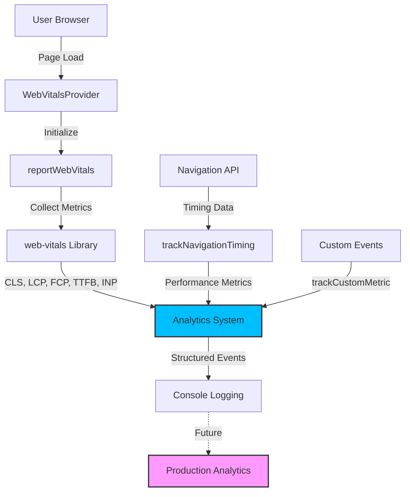

# Performance Monitoring & Web Vitals

**Last Updated:** 23rd May 2025  
**Target Audience:** Developers with 2+ years experience  
**Prerequisites:** Understanding of React, Next.js, and performance concepts

---

## 📊 Overview

Our performance monitoring system provides real-time insights into application performance using Core Web Vitals and custom metrics. This system was implemented to meet enterprise-grade observability standards.

### **What You'll Learn**

- How our Web Vitals tracking system works
- Custom performance metrics implementation
- Integration with analytics infrastructure
- Performance optimization strategies

---

## 🏗️ Architecture Overview



---

## 🎯 Core Web Vitals Implementation

### **Tracked Metrics**

| Metric   | Description               | Good Threshold | Implementation |
| -------- | ------------------------- | -------------- | -------------- |
| **CLS**  | Cumulative Layout Shift   | < 0.1          | `onCLS()`      |
| **LCP**  | Largest Contentful Paint  | < 2.5s         | `onLCP()`      |
| **FCP**  | First Contentful Paint    | < 1.8s         | `onFCP()`      |
| **TTFB** | Time to First Byte        | < 0.8s         | `onTTFB()`     |
| **INP**  | Interaction to Next Paint | < 200ms        | `onINP()`      |

### **Key Implementation Files**

```typescript
// Core Analytics System
src / lib / analytics / analytics.ts; // Enhanced analytics with Web Vitals support
src / lib / analytics / web - vitals.ts; // Web Vitals reporting implementation
src / lib / analytics / index.ts; // Unified exports

// Integration Points
src / components / providers / WebVitalsProvider.tsx; // Client-side initialization
src / app / layout.tsx; // Root layout integration
```

---

## 🔧 Implementation Details

### **Analytics System Enhancement**

Our analytics system was enhanced to support structured performance tracking:

```typescript
// Enhanced Analytics Interface
export interface WebVitalMetric {
  name: 'CLS' | 'FID' | 'FCP' | 'LCP' | 'TTFB' | 'INP';
  value: number;
  id: string;
  delta: number;
  rating: 'good' | 'needs-improvement' | 'poor';
  navigationType?: string;
}

export interface AnalyticsEvent {
  eventName: string;
  properties?: Record<string, unknown>;
  timestamp: string;
  userId?: string; // Future: Clerk user context
  sessionId?: string; // Future: Session tracking
}
```

### **Web Vitals Reporter**

The `reportWebVitals()` function initializes all Core Web Vitals tracking:

```typescript
// src/lib/analytics/web-vitals.ts
export function reportWebVitals() {
  // Browser environment check
  if (typeof window === 'undefined') return;

  const handleMetric = (metric: WebVitalsMetric) => {
    const webVitalMetric: WebVitalMetric = {
      name: metric.name as WebVitalMetric['name'],
      value: metric.value,
      id: metric.id,
      delta: metric.delta,
      rating: metric.rating as WebVitalMetric['rating'],
      navigationType: metric.navigationType,
    };

    Analytics.trackWebVital(webVitalMetric);
  };

  // Initialize Core Web Vitals tracking
  onCLS(handleMetric);
  onFCP(handleMetric);
  onLCP(handleMetric);
  onTTFB(handleMetric);
  onINP(handleMetric); // Replaces deprecated FID
}
```

### **Navigation Timing Tracking**

Advanced performance metrics capture detailed timing information:

```typescript
export function trackNavigationTiming() {
  window.addEventListener('load', () => {
    const navigation = performance.getEntriesByType('navigation')[0] as PerformanceNavigationTiming;

    if (navigation) {
      Analytics.trackPerformance(
        'navigation_timing',
        navigation.loadEventEnd - navigation.fetchStart,
        {
          dns_lookup: navigation.domainLookupEnd - navigation.domainLookupStart,
          tcp_connect: navigation.connectEnd - navigation.connectStart,
          request_response: navigation.responseEnd - navigation.requestStart,
          dom_processing: navigation.domContentLoadedEventEnd - navigation.responseEnd,
          load_event: navigation.loadEventEnd - navigation.loadEventStart,
        }
      );
    }
  });
}
```

---

## 🎛️ Integration & Setup

### **Root Layout Integration**

Performance tracking is initialized at the application root for comprehensive coverage:

```typescript
// src/app/layout.tsx
import { WebVitalsProvider } from '@/components/providers/WebVitalsProvider';

export default function RootLayout({ children }: { children: React.ReactNode }) {
  return (
    <ClerkProvider>
      <html lang="en">
        <body className={`${inter.className} bg-white`}>
          <LocalizationProvider>
            <WebVitalsProvider>  {/* Performance tracking initialization */}
              <SidebarProvider>
                <SearchProvider>
                  <ConditionalLayout>{children}</ConditionalLayout>
                </SearchProvider>
              </SidebarProvider>
            </WebVitalsProvider>
          </LocalizationProvider>
        </body>
      </html>
    </ClerkProvider>
  );
}
```

### **WebVitalsProvider Implementation**

The provider component handles client-side initialization:

```typescript
// src/components/providers/WebVitalsProvider.tsx
export function WebVitalsProvider({ children }: { children: React.ReactNode }) {
  useEffect(() => {
    // Initialize Web Vitals tracking
    reportWebVitals();

    // Track navigation timing
    trackNavigationTiming();

    // Log initialization
    if (typeof window !== 'undefined') {
      const pageName = window.location.pathname;
      console.log(`[WebVitals] Initialized tracking for page: ${pageName}`);
    }
  }, []);

  return <>{children}</>;
}
```

---

## 📈 Current Monitoring Capabilities

### **Real-time Metrics Collection**

Currently implemented and active:

- ✅ **Core Web Vitals** - All major performance metrics
- ✅ **Navigation Timing** - Detailed load performance breakdown
- ✅ **Custom Performance Metrics** - Extensible tracking system
- ✅ **Structured Logging** - Consistent event format with timestamps
- ✅ **Type Safety** - Full TypeScript interfaces

### **Console Output Example**

```javascript
[Analytics] Web Vital - LCP {
  "eventName": "web_vital",
  "properties": {
    "metric_name": "LCP",
    "metric_value": 1247.2,
    "metric_rating": "good",
    "metric_delta": 1247.2,
    "metric_id": "v3-1641234567890",
    "navigation_type": "navigate"
  },
  "timestamp": "2025-01-23T10:30:45.123Z"
}
```

---

## 🔮 Production Integration Roadmap

### **Analytics Service Integration**

Ready for immediate integration with production analytics services:

```typescript
// Future: Production analytics integration
export const Analytics = {
  trackWebVital: (metric: WebVitalMetric) => {
    // Current: Console logging
    console.log(`[Analytics] Web Vital - ${metric.name}`, event);

    // TODO: Production integrations
    // datadog.increment('web_vitals.count', 1, [`metric:${metric.name}`, `rating:${metric.rating}`]);
    // newrelic.addPageAction('WebVital', metric);
    // gtag('event', 'web_vitals', { metric_name: metric.name, value: metric.value });
  },
};
```

### **Recommended Analytics Services**

| Service                | Use Case               | Integration Complexity |
| ---------------------- | ---------------------- | ---------------------- |
| **DataDog**            | Enterprise APM         | Medium                 |
| **New Relic**          | Performance monitoring | Medium                 |
| **Google Analytics 4** | Basic web vitals       | Low                    |
| **Vercel Analytics**   | Next.js optimized      | Low                    |

---

## 🎯 Performance Optimization Guidelines

### **Core Web Vitals Optimization**

Based on bundle analysis findings:

#### **Large Page Optimization Targets**

- `/brand-lift/campaign-review-setup/[campaignId]` - **454kB** → Target: <200kB
- `/campaigns/[campaignId]` - **468kB** → Target: <200kB

#### **Optimization Strategies**

1. **Code Splitting**

   ```typescript
   // Dynamic imports for large components
   const CampaignReviewSetup = dynamic(() => import('./CampaignReviewSetup'), {
     loading: () => <LoadingSkeleton />
   });
   ```

2. **Bundle Analysis**

   ```bash
   # Run bundle analysis (already configured)
   npm run analyze
   ```

3. **Performance Budgets**
   ```javascript
   // future: webpack.config.js performance budgets
   module.exports = {
     performance: {
       maxAssetSize: 250000,
       maxEntrypointSize: 250000,
     },
   };
   ```

---

## 🔍 Debugging Performance Issues

### **Performance Investigation Workflow**

1. **Check Web Vitals Console Logs**

   ```javascript
   // Look for metrics with 'needs-improvement' or 'poor' ratings
   [Analytics] Web Vital - CLS { "metric_rating": "poor", "metric_value": 0.25 }
   ```

2. **Analyse Navigation Timing**

   ```javascript
   // Identify bottlenecks in load process
   [Analytics] Performance - navigation_timing {
     "dns_lookup": 45,      // DNS resolution time
     "tcp_connect": 120,    // Connection establishment
     "request_response": 850, // Server response time
     "dom_processing": 340   // DOM parsing time
   }
   ```

3. **Use Browser DevTools**
   - **Performance tab** - Detailed timing analysis
   - **Lighthouse** - Automated performance audits
   - **Network tab** - Resource loading analysis

### **Common Performance Issues**

| Issue         | Symptom                    | Solution                            |
| ------------- | -------------------------- | ----------------------------------- |
| **High LCP**  | Slow largest content paint | Optimize images, reduce bundle size |
| **High CLS**  | Layout shifts              | Reserve space for dynamic content   |
| **High INP**  | Slow interactions          | Optimize JavaScript execution       |
| **High TTFB** | Slow server response       | Database query optimization         |

---

## 🧪 Testing Performance

### **Local Performance Testing**

```bash
# Run development server with performance tracking
npm run dev

# Open browser and check console for Web Vitals output
# Navigate through application to collect metrics
```

### **Performance Regression Prevention**

```typescript
// Custom performance testing helpers
export function trackCustomMetric(
  name: string,
  value: number,
  additionalData?: Record<string, unknown>
) {
  Analytics.trackPerformance(name, value, additionalData);
}

// Example usage in components
useEffect(() => {
  const startTime = performance.now();

  // Component rendering logic

  const renderTime = performance.now() - startTime;
  trackCustomMetric('component_render_time', renderTime, { component: 'CampaignWizard' });
}, []);
```

---

## 📚 Further Reading

- **[Web Vitals Official Guide](https://web.dev/vitals/)** - Google's performance metrics
- **[Next.js Performance](https://nextjs.org/docs/advanced-features/measuring-performance)** - Framework-specific optimizations
- **[Bundle Analysis Guide](../performance/bundle-optimisation.md)** - Code splitting strategies
- **[Database Performance](../database/performance.md)** - Backend optimization

---

## 🔄 Maintenance & Updates

### **Keeping Performance Monitoring Current**

1. **Regular Review** - Monthly performance metric analysis
2. **Threshold Updates** - Adjust performance budgets as needed
3. **New Metrics** - Add custom metrics for new features
4. **Analytics Integration** - Migrate from console logging to production analytics

### **Documentation Updates**

This document should be updated when:

- New performance metrics are added
- Analytics service integrations are implemented
- Performance optimization strategies change
- Bundle analysis reveals new optimization opportunities

---

_This documentation follows Silicon Valley scale-up standards for technical depth and practical utility._
