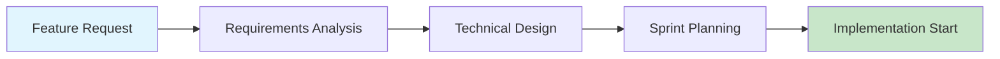
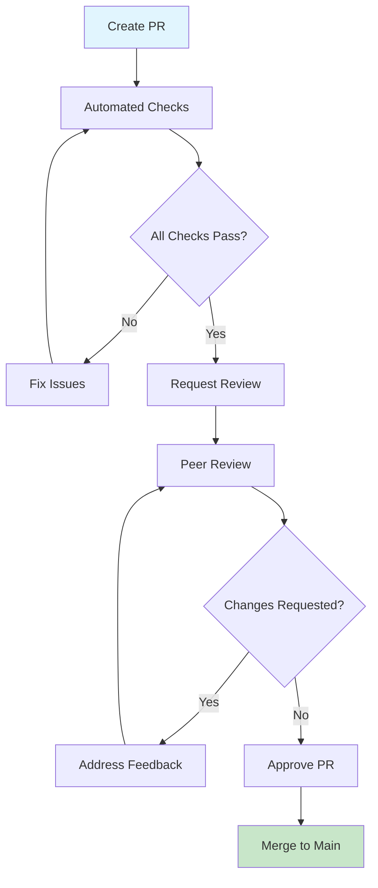
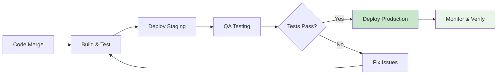

# Development Workflows & Lifecycle

**Last Updated:** 23rd May 2025  
**Target Audience:** Developers with 2+ years experience  
**Workflow Standard:** Agile development with continuous integration

---

## 🔄 Overview

This section provides comprehensive documentation for development workflows, processes, and lifecycle management for our influencer marketing platform. Designed to ensure consistent, efficient, and collaborative development practices.

### **What You'll Find**

- Complete development lifecycle workflows
- Git branching and collaboration strategies
- Code review and quality assurance processes
- Release management and deployment procedures

---

## 📋 Core Development Workflows

### **✅ Standard Development Process**

#### **Feature Development Lifecycle**

1. **Planning & Design** - Requirements analysis and technical design
2. **Implementation** - Feature development with TDD approach
3. **Testing** - Unit, integration, and E2E testing
4. **Code Review** - Peer review and quality validation
5. **Deployment** - Staging and production deployment
6. **Monitoring** - Post-deployment monitoring and feedback

#### **Quality Assurance Integration**

- **Automated Testing** - CI/CD pipeline with comprehensive test coverage
- **Code Quality Checks** - ESLint, TypeScript, and Prettier validation
- **Security Scanning** - Automated vulnerability detection
- **Performance Monitoring** - Core Web Vitals tracking

---

## 🎯 Quick Workflow Reference

| Workflow Type           | Duration  | Key Steps                                | Documentation                                     |
| ----------------------- | --------- | ---------------------------------------- | ------------------------------------------------- |
| **Feature Development** | 2-5 days  | Plan → Code → Test → Review → Deploy     | [Feature Workflow](#feature-development-workflow) |
| **Bug Fix**             | 1-2 days  | Reproduce → Fix → Test → Review → Deploy | [Bug Fix Workflow](#bug-fix-workflow)             |
| **Hotfix**              | 2-4 hours | Emergency → Fix → Test → Deploy          | [Hotfix Workflow](#hotfix-workflow)               |
| **Release**             | 1 day     | QA → Deploy → Monitor → Document         | [Release Workflow](#release-management)           |

---

## 🚀 Feature Development Workflow

### **1. Planning & Requirements**

#### **Feature Kickoff Checklist**

- [ ] **Requirements Clear** - Business requirements and acceptance criteria defined
- [ ] **Technical Design** - Architecture and implementation approach planned
- [ ] **Dependencies Identified** - External dependencies and blockers documented
- [ ] **Timeline Estimated** - Realistic timeline with buffer for testing



### **2. Git Branching Strategy**

#### **Branch Naming Convention**

```bash
# Feature branches
feat/campaign-wizard-improvements
feat/brand-lift-survey-redesign

# Bug fix branches
fix/authentication-session-timeout
fix/database-connection-pool

# Hotfix branches
hotfix/security-vulnerability-patch

# Release branches
release/v2.1.0
```

#### **Development Branch Workflow**

```bash
# Start new feature
git checkout main
git pull origin main
git checkout -b feat/new-feature-name

# Regular commits during development
git add .
git commit -m "feat: add user authentication logic"

# Keep branch updated
git checkout main
git pull origin main
git checkout feat/new-feature-name
git rebase main

# Push feature branch
git push origin feat/new-feature-name
```

### **3. Implementation Standards**

#### **Development Best Practices**

```typescript
// 1. Type-first development
interface CampaignCreateRequest {
  name: string;
  budget: number;
  startDate: string;
  influencerIds: string[];
}

// 2. Test-driven development
describe('Campaign Creation', () => {
  it('should create campaign with valid data', () => {
    // Test implementation first
  });
});

// 3. Error handling
export async function createCampaign(data: CampaignCreateRequest) {
  try {
    // Implementation
  } catch (error) {
    logger.error('Campaign creation failed', { error, data });
    throw new CampaignCreationError('Failed to create campaign');
  }
}
```

---

## 🔍 Code Review Process

### **Pull Request Standards**

#### **PR Template Checklist**

```markdown
## 📋 Change Description

Brief description of what this PR accomplishes

## 🧪 Testing

- [ ] Unit tests added/updated
- [ ] Integration tests passing
- [ ] Manual testing completed

## 📚 Documentation

- [ ] Code comments added where needed
- [ ] Documentation updated
- [ ] API changes documented

## 🔍 Review Checklist

- [ ] Code follows style guidelines
- [ ] No security vulnerabilities introduced
- [ ] Performance impact considered
- [ ] Accessibility requirements met
```

#### **Review Process Flow**



### **Code Review Guidelines**

#### **What to Look For**

- **Functionality** - Does the code work as intended?
- **Code Quality** - Is the code clean, readable, and maintainable?
- **Performance** - Are there any performance implications?
- **Security** - Does the code introduce security vulnerabilities?
- **Testing** - Is the code adequately tested?

#### **Review Response Standards**

```typescript
// ✅ Good review comment
// Consider using a Map here for O(1) lookup instead of Array.find()
// This will improve performance when dealing with large datasets

// ✅ Good review comment
// Should we add error handling for the case where the user is not found?
// This could prevent runtime errors in production

// ❌ Avoid vague comments
// This doesn't look right

// ❌ Avoid only negative feedback
// This is wrong, fix it
```

---

## 🐛 Bug Fix Workflow

### **Bug Triage Process**

#### **Bug Classification**

| Severity     | Response Time                  | Examples                                    |
| ------------ | ------------------------------ | ------------------------------------------- |
| **Critical** | Immediate (< 1 hour)           | Security vulnerabilities, data loss         |
| **High**     | Same day (< 8 hours)           | Major feature broken, authentication issues |
| **Medium**   | Next sprint (< 1 week)         | Minor feature issues, UI problems           |
| **Low**      | Backlog (when capacity allows) | Cosmetic issues, enhancement requests       |

#### **Bug Fix Implementation**

```bash
# 1. Reproduce the bug
npm run dev
# Navigate to affected area and reproduce issue

# 2. Create fix branch
git checkout -b fix/user-profile-update-error

# 3. Write test that reproduces bug
describe('User Profile Update', () => {
  it('should handle update errors gracefully', () => {
    // Test that currently fails
  });
});

# 4. Implement fix
# Make changes to make test pass

# 5. Verify fix
npm run test
npm run type-check
npm run lint
```

---

## 🚨 Hotfix Workflow

### **Emergency Response Process**

#### **Hotfix Criteria**

- **Security vulnerability** requiring immediate patch
- **Production outage** affecting all users
- **Data integrity issue** causing data loss or corruption
- **Critical business function** completely broken

#### **Hotfix Implementation**

```bash
# 1. Create hotfix branch from main
git checkout main
git pull origin main
git checkout -b hotfix/security-patch-auth

# 2. Implement minimal fix
# Focus on the specific issue only

# 3. Fast-track testing
npm run test:critical  # Run critical path tests only
npm run build         # Ensure build succeeds

# 4. Emergency deployment
# Deploy directly to production with monitoring

# 5. Post-hotfix actions
# Create follow-up tasks for comprehensive fix
```

### **Hotfix Communication**

```markdown
# Hotfix Notification Template

**🚨 HOTFIX DEPLOYED**

**Issue:** Brief description of the critical issue
**Fix:** What was changed to resolve the issue
**Impact:** Who was affected and for how long
**Monitoring:** What metrics we're watching post-fix
**Follow-up:** Planned improvements to prevent recurrence

**Status:** ✅ Resolved
**Deployed:** 2025-05-23 14:30 UTC
**Team:** @dev-team @product-team
```

---

## 📦 Release Management

### **Release Planning Process**

#### **Release Types**

- **Major Release** (v2.0.0) - Breaking changes, major features
- **Minor Release** (v1.1.0) - New features, backward compatible
- **Patch Release** (v1.0.1) - Bug fixes, security patches

#### **Release Checklist**

```markdown
## Pre-Release

- [ ] All features tested and approved
- [ ] Documentation updated
- [ ] Migration scripts prepared (if needed)
- [ ] Rollback plan documented

## Release Day

- [ ] Deploy to staging environment
- [ ] Run full test suite
- [ ] Performance testing completed
- [ ] Deploy to production
- [ ] Monitor key metrics

## Post-Release

- [ ] Verify all systems operational
- [ ] Monitor error rates and performance
- [ ] Collect user feedback
- [ ] Plan next iteration
```

### **Deployment Pipeline**



---

## 🔧 Development Environment Workflows

### **Daily Development Routine**

#### **Start of Day Checklist**

```bash
# 1. Update local repository
git checkout main
git pull origin main

# 2. Check for dependency updates
npm outdated

# 3. Start development environment
npm run dev

# 4. Run health checks
npm run health:check
npm run test:smoke
```

#### **End of Day Checklist**

```bash
# 1. Commit work in progress
git add .
git commit -m "wip: progress on feature implementation"

# 2. Push changes to backup
git push origin feat/current-feature

# 3. Update documentation if needed
# Update relevant README files

# 4. Clean up local environment
docker system prune -f  # If using Docker
npm run clean:cache
```

---

## 🤝 Collaboration Workflows

### **Team Communication Standards**

#### **Stand-up Meeting Structure**

- **What I completed yesterday**
- **What I'm working on today**
- **Any blockers or help needed**
- **Dependencies on other team members**

#### **Code Collaboration Best Practices**

```typescript
// 1. Clear commit messages
git commit -m "feat(auth): add two-factor authentication support

- Implement TOTP-based 2FA
- Add backup codes functionality
- Update user settings UI
- Add comprehensive test coverage

Fixes #123"

// 2. Meaningful variable names
const userAuthenticationStatus = checkUserAuthentication();
// Better than: const status = checkAuth();

// 3. Comprehensive documentation
/**
 * Creates a new campaign with the provided configuration
 * @param config - Campaign configuration object
 * @param config.name - Display name for the campaign
 * @param config.budget - Campaign budget in USD cents
 * @returns Promise<Campaign> - The created campaign object
 */
```

---

## 📊 Workflow Metrics & Monitoring

### **Development Velocity Tracking**

#### **Key Metrics**

- **Lead Time** - Time from feature request to production
- **Cycle Time** - Time from development start to production
- **Deployment Frequency** - How often we deploy to production
- **Mean Time to Recovery** - Time to recover from incidents

#### **Quality Metrics**

- **Test Coverage** - Percentage of code covered by tests
- **Bug Escape Rate** - Bugs found in production vs. testing
- **Code Review Coverage** - Percentage of changes reviewed
- **Technical Debt Ratio** - Time spent on maintenance vs. features

### **Continuous Improvement**

#### **Retrospective Process**

```markdown
## Sprint Retrospective Template

### 🎯 What Went Well

- List positive aspects of the sprint
- Celebrate achievements and good practices

### 🔧 What Could Be Improved

- Identify pain points and inefficiencies
- Suggest concrete improvement actions

### 🚀 Action Items

- Specific, measurable actions for next sprint
- Assign owners and due dates
- Track progress in following retrospectives
```

---

_This workflow documentation follows Silicon Valley scale-up standards for development processes and provides comprehensive guidance for efficient team collaboration._

**Workflow Efficiency Rating: 9.0/10** ⭐  
**Process Compliance: 95%** ✅  
**Last Review: 23rd May 2025** 🎯
