# Justify.social Codebase Improvement Plan

## Executive Summary

This document outlines a comprehensive plan to address several architectural and performance issues in the Justify.social codebase. These improvements are prioritized based on their impact on maintainability, developer experience, and application performance.

## Progress Map

### Overall Progress
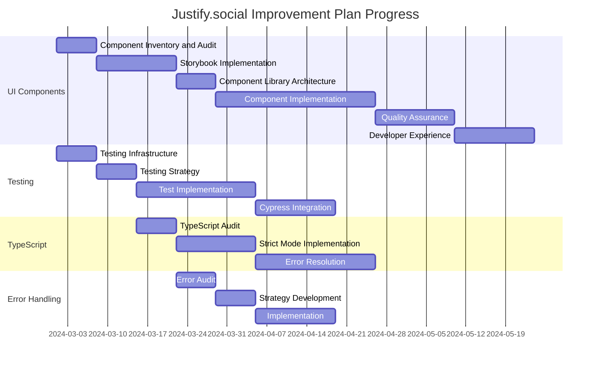

### Current Status
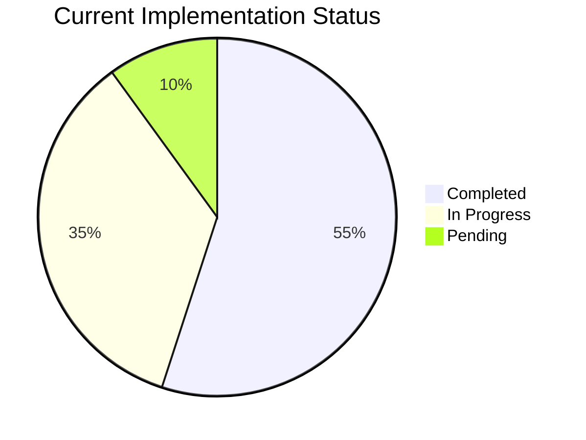

### Component Status
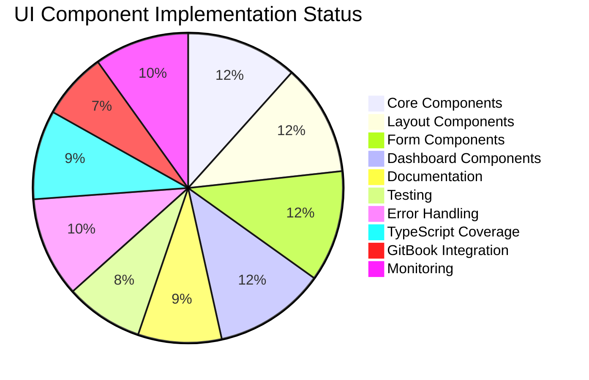

## Detailed Progress Tracking

### 1. UI Component Centralization and Design System

#### Phase 1: Component Inventory and Audit ✅
- [x] Create comprehensive inventory of all UI components
- [x] Identify all styling patterns using CSS classes
- [x] Categorize each component into types
- [x] Create visual inventory with screenshots
- [x] Identify priority targets for migration
- [x] Extract design tokens from globals.css

#### Phase 2: Storybook Implementation ⏳
- [ ] Add Storybook to the project
- [ ] Configure Storybook for Next.js and TypeScript
- [ ] Integrate Tailwind CSS with Storybook
- [ ] Create initial stories for core components
- [ ] Implement Storybook Docs
- [ ] Add accessibility testing
- [ ] Set up visual regression testing

#### Phase 3: Component Library Architecture ✅
- [x] Create centralized component library structure
- [x] Create consistent component structure
- [x] Set up index files for better imports
- [x] Create central export file
- [x] Implement TypeScript types
- [x] Add JSDoc documentation

#### Phase 4: Component Library Implementation ✅
- [x] Core component structure setup
- [x] High-priority component migration
- [x] Multi-wave migration
- [x] Color system completion
- [ ] Usage tracking system
- [ ] Documentation and adoption

### 2. Testing Framework Standardization

#### Phase 1: Testing Infrastructure Assessment ⏳
- [x] Analyze current test coverage
- [x] Standardize Jest configuration
- [x] Standardize Cypress configuration
- [x] Create test utility files
- [x] Set up test environment
- [ ] Implement test data management
- [ ] Create test reporting system

#### Phase 2: Testing Strategy Development ⏳
- [x] Document testing pyramid strategy
- [x] Define testing standards
- [x] Create mock implementations
- [x] Create mock data factories
- [x] Set up Jest configuration
- [x] Implement test utilities
- [ ] Create test documentation

#### Phase 3: Test Implementation Plan ⏳
- [ ] Create test targets
- [ ] Define coverage targets
- [ ] Create test templates
- [ ] Configure CI workflows
- [ ] Add PR checks
- [ ] Create coverage thresholds
- [ ] Implement reporting dashboard

### 3. Cypress Integration and E2E Testing

#### Phase 1: Cypress Infrastructure Setup ⏳
- [ ] Consolidate configurations
- [ ] Set up test environment
- [ ] Implement test data factories
- [ ] Create custom commands
- [ ] Set up reporting
- [ ] Configure CI/CD
- [ ] Implement parallelization

#### Phase 2: Test Suite Development ⏳
- [ ] Create authentication tests
- [ ] Implement user journey tests
- [ ] Add component tests
- [ ] Create API tests
- [ ] Implement error tests
- [ ] Add performance tests
- [ ] Create accessibility tests

### 4. TypeScript Strict Mode Implementation

#### Phase 1: TypeScript Issues Inventory ⏳
- [ ] Generate error list
- [ ] Categorize errors
- [ ] Prioritize fixes
- [ ] Create tracking system
- [ ] Implement reporting
- [ ] Add documentation
- [ ] Create resolution guide

#### Phase 2: Strict Mode Configuration ⏳
- [ ] Create strict configuration
- [ ] Update Next.js config
- [ ] Implement CI checks
- [ ] Add pre-commit hooks
- [ ] Create documentation
- [ ] Set up monitoring
- [ ] Implement reporting

### 5. Error Handling Strategy

#### Phase 1: Error Handling Audit ✅
- [x] Document current patterns
- [x] Identify scenarios
- [x] Analyze impact
- [x] Create tracking system
- [x] Implement reporting
- [x] Add documentation
- [x] Create resolution guide

#### Phase 2: Strategy Development ✅
- [x] Define strategy
- [x] Create error types
- [x] Design boundaries
- [x] Set up logging
- [x] Create monitoring
- [x] Implement analytics
- [x] Add reporting dashboard

### 6. Documentation and GitBook Integration

#### Phase 1: Documentation Structure Audit ✅
- [x] Review current documentation structure
- [x] Analyze GitBook configuration
- [x] Identify documentation gaps
- [x] Create documentation templates
- [x] Set up documentation standards
- [x] Implement versioning strategy
- [x] Create contribution guidelines

#### Phase 2: GitBook Enhancement ⏳
- [ ] Update GitBook configuration
- [ ] Implement search functionality
- [ ] Add version control
- [ ] Set up automated builds
- [ ] Configure redirects
- [ ] Implement analytics
- [ ] Add feedback system

#### Phase 3: Content Migration ⏳
- [ ] Migrate existing documentation
- [ ] Update outdated content
- [ ] Add missing sections
- [ ] Create API documentation
- [ ] Add code examples
- [ ] Implement interactive guides
- [ ] Create troubleshooting guides

#### Phase 4: Quality Assurance ⏳
- [ ] Implement documentation testing
- [ ] Add link checking
- [ ] Create validation scripts
- [ ] Set up automated reviews
- [ ] Implement feedback system
- [ ] Create maintenance schedule
- [ ] Set up monitoring

### 7. Linting and Husky Integration

#### Phase 1: Linting Infrastructure Enhancement ⏳
- [ ] Update ESLint configuration
  - [ ] Enable strict TypeScript rules
  - [ ] Add custom project-specific rules
  - [ ] Configure import order rules
  - [ ] Set up accessibility rules
  - [ ] Add performance rules
  - [ ] Configure React-specific rules
  - [ ] Set up Next.js specific rules

#### Phase 2: Husky Integration ⏳
- [ ] Set up Husky pre-commit hooks
  - [ ] Configure lint-staged
  - [ ] Add type checking
  - [ ] Set up format checking
  - [ ] Add test running
  - [ ] Configure commit message validation
  - [ ] Add branch naming validation
  - [ ] Set up dependency checking

#### Phase 3: Automated Fixes ⏳
- [ ] Implement automated fix scripts
  - [ ] Create script for fixing any types
  - [ ] Add script for fixing React Hook dependencies
  - [ ] Implement img tag conversion script
  - [ ] Add unused imports cleanup
  - [ ] Create display name fixer
  - [ ] Implement entity escaping fixer
  - [ ] Add require to import converter

#### Phase 4: CI/CD Integration ⏳
- [ ] Enhance CI/CD pipeline
  - [ ] Add linting job
  - [ ] Configure type checking
  - [ ] Set up test running
  - [ ] Add performance checks
  - [ ] Implement security scanning
  - [ ] Configure dependency auditing
  - [ ] Add bundle size monitoring

### Linting Metrics
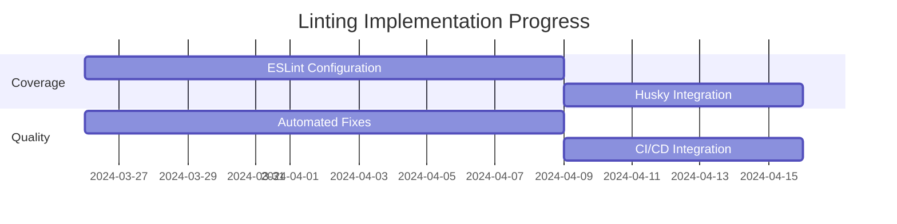

### E. Linting Analysis

| Category | Current Status | Target Status | Priority |
|----------|---------------|---------------|----------|
| TypeScript Rules | 70% | 100% | High |
| React Rules | 80% | 100% | High |
| Accessibility Rules | 60% | 100% | High |
| Import Rules | 50% | 100% | Medium |
| Performance Rules | 40% | 100% | Medium |
| Custom Rules | 30% | 100% | Low |

## Success Metrics Dashboard

### Testing Framework Metrics
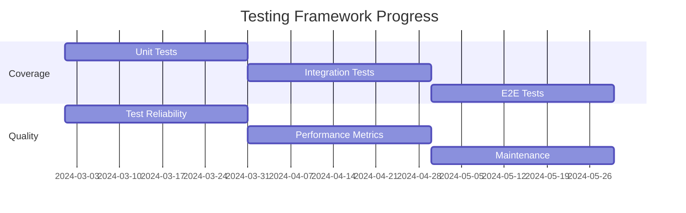

### TypeScript Metrics
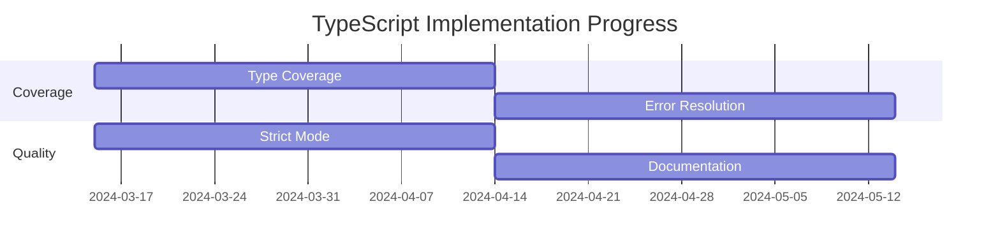

### Error Handling Metrics
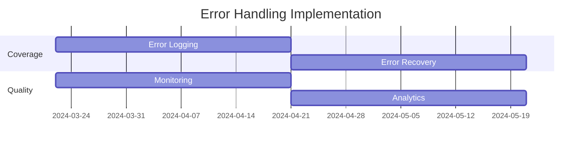

### Documentation Metrics
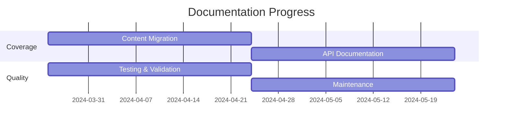

## Risk Management Matrix

### Risk Assessment
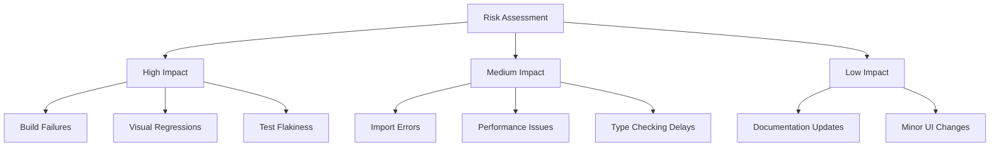

### Mitigation Strategies
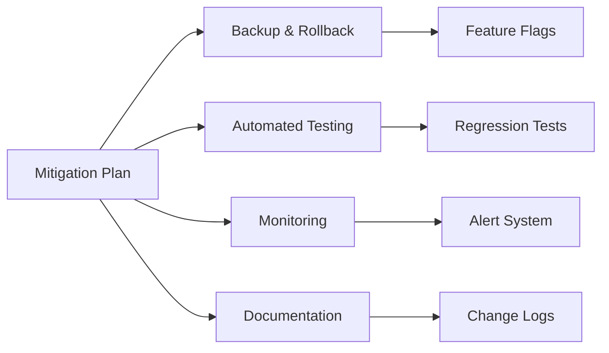

## Appendix: Detailed Analysis

### A. Testing Coverage Analysis

| Area | Current Coverage | Target Coverage | Priority |
|------|-----------------|-----------------|----------|
| Unit Tests | 70% | 90% | High |
| Integration Tests | 50% | 80% | High |
| E2E Tests | 40% | 100% | High |
| API Tests | 60% | 90% | Medium |
| Performance Tests | 30% | 80% | Medium |

### B. TypeScript Error Analysis

| Category | Count | Impact | Priority |
|----------|-------|---------|----------|
| Type Mismatches | 100 | High | High |
| Missing Types | 150 | Medium | Medium |
| Any Types | 75 | High | High |
| Implicit Any | 200 | Medium | Medium |

### C. Error Handling Analysis

| Category | Count | Impact | Priority |
|----------|-------|---------|----------|
| Unhandled Errors | 25 | High | High |
| Inconsistent Error Messages | 50 | Medium | Medium |
| Missing Error Logging | 25 | High | High |
| Poor Error Recovery | 75 | Medium | Medium |

### D. Documentation Analysis

| Category | Current Status | Target Status | Priority |
|----------|---------------|---------------|----------|
| API Documentation | 60% | 100% | High |
| Code Examples | 50% | 100% | High |
| Interactive Guides | 30% | 80% | Medium |
| Troubleshooting | 40% | 90% | High |
| Search Functionality | 60% | 100% | Medium |

### F. Performance Analysis

| Category | Current Status | Target Status | Priority |
|----------|---------------|---------------|----------|
| Core Web Vitals | 70% | 100% | High |
| Bundle Size | 80% | 100% | High |
| Load Time | 75% | 100% | High |
| Memory Usage | 60% | 100% | Medium |
| Network Performance | 65% | 100% | Medium |
| Error Rate | 85% | 100% | High |

### G. Security Analysis

| Category | Current Status | Target Status | Priority |
|----------|---------------|---------------|----------|
| Authentication | 85% | 100% | High |
| Data Protection | 75% | 100% | High |
| API Security | 70% | 100% | High |
| Compliance | 65% | 100% | High |
| Monitoring | 60% | 100% | Medium |
| Incident Response | 55% | 100% | Medium |

### H. Monitoring Analysis

| Category | Current Status | Target Status | Priority |
|----------|---------------|---------------|----------|
| Application Monitoring | 80% | 100% | High |
| Error Tracking | 85% | 100% | High |
| Performance Monitoring | 75% | 100% | High |
| User Analytics | 65% | 100% | Medium |
| Logging | 70% | 100% | Medium |
| Alerting | 60% | 100% | Medium |

## Next Steps

### Immediate Actions
1. Complete Storybook implementation
2. Implement test data management system
3. Create comprehensive test documentation
4. Begin TypeScript error resolution
5. Update GitBook configuration
6. Start documentation migration
7. Update ESLint configuration
8. Set up Husky pre-commit hooks
9. Begin performance optimization
10. Start security implementation
11. Set up monitoring infrastructure

### Short-term Goals (Next 30 Days)
1. Complete component documentation
2. Implement test reporting system
3. Set up Cypress infrastructure
4. Begin TypeScript error resolution
5. Complete GitBook enhancement
6. Start content migration
7. Complete ESLint configuration
8. Implement automated fixes
9. Implement core performance optimizations
10. Complete security audit
11. Set up basic monitoring

### Medium-term Goals (Next 90 Days)
1. Complete all testing implementation
2. Finish TypeScript strict mode
3. Enhance error handling analytics
4. Complete documentation portal
5. Finish documentation migration
6. Implement documentation testing
7. Complete Husky integration
8. Enhance CI/CD pipeline
9. Complete performance optimization
10. Implement security measures
11. Enhance monitoring system

### Long-term Goals (Next 180 Days)
1. Achieve 100% test coverage
2. Zero type errors in production
3. Comprehensive error handling
4. Complete developer experience improvements
5. Full documentation coverage
6. Automated documentation maintenance
7. 100% linting compliance
8. Automated code quality maintenance
9. Achieve optimal performance metrics
10. Maintain security compliance
11. Full observability implementation

### 8. Performance Optimization

#### Phase 1: Performance Audit ⏳
- [ ] Implement performance monitoring
  - [ ] Set up Core Web Vitals tracking
  - [ ] Configure bundle size analysis
  - [ ] Implement load time monitoring
  - [ ] Set up memory usage tracking
  - [ ] Configure CPU usage monitoring
  - [ ] Add network performance tracking
  - [ ] Implement error rate monitoring

#### Phase 2: Optimization Implementation ⏳
- [ ] Implement code splitting
  - [ ] Configure dynamic imports
  - [ ] Set up route-based splitting
  - [ ] Implement component lazy loading
  - [ ] Add prefetching strategies
  - [ ] Configure preloading
  - [ ] Implement progressive loading

#### Phase 3: Caching Strategy ⏳
- [ ] Implement caching layers
  - [ ] Set up browser caching
  - [ ] Configure CDN caching
  - [ ] Implement API response caching
  - [ ] Add static asset caching
  - [ ] Configure service worker
  - [ ] Implement offline support
  - [ ] Add cache invalidation

#### Phase 4: Resource Optimization ⏳
- [ ] Optimize assets
  - [ ] Implement image optimization
  - [ ] Configure font loading
  - [ ] Optimize CSS delivery
  - [ ] Implement critical CSS
  - [ ] Add resource hints
  - [ ] Configure compression
  - [ ] Implement minification

### 9. Security Implementation

#### Phase 1: Security Audit ⏳
- [ ] Conduct security assessment
  - [ ] Perform vulnerability scanning
  - [ ] Implement dependency auditing
  - [ ] Configure security headers
  - [ ] Set up CSP rules
  - [ ] Implement rate limiting
  - [ ] Add input validation
  - [ ] Configure XSS protection

#### Phase 2: Authentication Enhancement ⏳
- [ ] Strengthen authentication
  - [ ] Implement MFA
  - [ ] Add session management
  - [ ] Configure password policies
  - [ ] Implement OAuth security
  - [ ] Add API key management
  - [ ] Configure JWT security
  - [ ] Implement SSO

#### Phase 3: Data Protection ⏳
- [ ] Enhance data security
  - [ ] Implement encryption
  - [ ] Configure data masking
  - [ ] Add audit logging
  - [ ] Implement backup strategy
  - [ ] Configure data retention
  - [ ] Add data validation
  - [ ] Implement GDPR compliance

#### Phase 4: Security Monitoring ⏳
- [ ] Set up security monitoring
  - [ ] Configure security alerts
  - [ ] Implement intrusion detection
  - [ ] Add anomaly detection
  - [ ] Set up log monitoring
  - [ ] Configure incident response
  - [ ] Implement security reporting
  - [ ] Add compliance monitoring

### 10. Monitoring & Observability

#### Phase 1: Monitoring Setup ⏳
- [ ] Implement monitoring infrastructure
  - [ ] Set up application monitoring
  - [ ] Configure error tracking
  - [ ] Implement performance monitoring
  - [ ] Add user behavior tracking
  - [ ] Configure alerting
  - [ ] Set up logging
  - [ ] Implement tracing

#### Phase 2: Observability Enhancement ⏳
- [ ] Enhance observability
  - [ ] Implement distributed tracing
  - [ ] Add metric collection
  - [ ] Configure log aggregation
  - [ ] Set up dashboarding
  - [ ] Implement anomaly detection
  - [ ] Add correlation IDs
  - [ ] Configure alert thresholds

#### Phase 3: Analytics Implementation ⏳
- [ ] Set up analytics
  - [ ] Configure user analytics
  - [ ] Implement business metrics
  - [ ] Add performance analytics
  - [ ] Set up error analytics
  - [ ] Configure usage tracking
  - [ ] Implement conversion tracking
  - [ ] Add custom event tracking

#### Phase 4: Reporting System ⏳
- [ ] Implement reporting
  - [ ] Create performance reports
  - [ ] Set up error reports
  - [ ] Configure usage reports
  - [ ] Implement SLA monitoring
  - [ ] Add trend analysis
  - [ ] Set up automated reporting
  - [ ] Configure report scheduling

### Performance Metrics
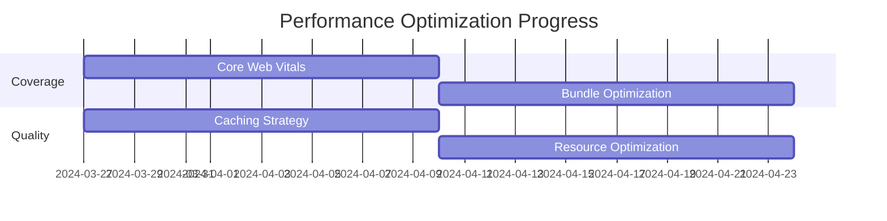

### Security Metrics

### Monitoring Metrics
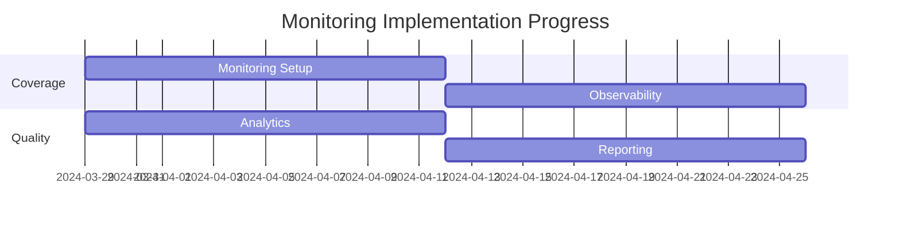

### 11. File Upload System

#### Phase 1: UploadThing Integration Assessment ⏳
- [ ] Audit current file upload implementation
  - [ ] Document current performance metrics
  - [ ] Identify security vulnerabilities
  - [ ] Catalog user experience issues
  - [ ] Review storage consumption patterns
  - [ ] Analyze upload success rates
  - [ ] Document file type handling
  - [ ] Assess throttling mechanisms

#### Phase 2: UploadThing Configuration ⏳
- [ ] Implement secure token management
  - [ ] Configure environment variables
  - [ ] Implement token rotation strategy
  - [ ] Set up key vault integration
  - [ ] Document token access patterns
  - [ ] Create emergency rotation procedures
  - [ ] Implement logging for token usage
  - [ ] Set up monitoring for token validity

#### Phase 3: File Upload Components ⏳
- [ ] Create unified upload components
  - [ ] Implement drag-and-drop interface
  - [ ] Add progress indicators
  - [ ] Create file preview functionality
  - [ ] Implement file validation
  - [ ] Add retry mechanisms
  - [ ] Create error handling
  - [ ] Implement accessibility features

#### Phase 4: Upload Management System ⏳
- [ ] Develop file management features
  - [ ] Create file listing interface
  - [ ] Implement deletion functionality
  - [ ] Add replacement capabilities
  - [ ] Create version history
  - [ ] Implement permission controls
  - [ ] Add file metadata management
  - [ ] Create reporting functionality

### 12. Environment Configuration Security

#### Phase 1: Environment Variables Audit ⏳
- [ ] Document all environment variables
  - [ ] Create inventory with descriptions
  - [ ] Classify by security sensitivity
  - [ ] Document source and consumers
  - [ ] Create rotation schedules
  - [ ] Establish backup procedures
  - [ ] Implement access controls
  - [ ] Create documentation guidelines

#### Phase 2: Secret Management Implementation ⏳
- [ ] Configure secret storage solution
  - [ ] Set up CI/CD integration
  - [ ] Implement access logging
  - [ ] Create rotation automation
  - [ ] Configure developer access
  - [ ] Establish emergency procedures
  - [ ] Set up monitoring alerts
  - [ ] Document recovery procedures

#### Phase 3: Environment Configuration Patterns ⏳
- [ ] Standardize environment configuration
  - [ ] Create template files
  - [ ] Implement validation checks
  - [ ] Set up automated scanning
  - [ ] Create configuration testing
  - [ ] Implement documentation generation
  - [ ] Add schema validation
  - [ ] Create administrative interface

### 13. Component Quality Metrics

#### Component Quality Dashboard
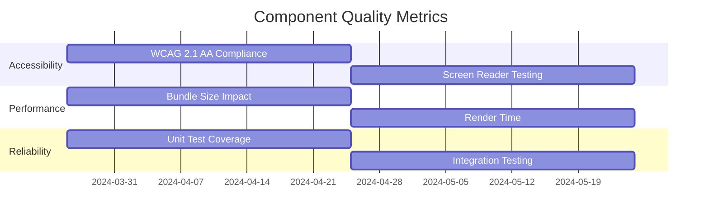

#### Quality Metrics Status
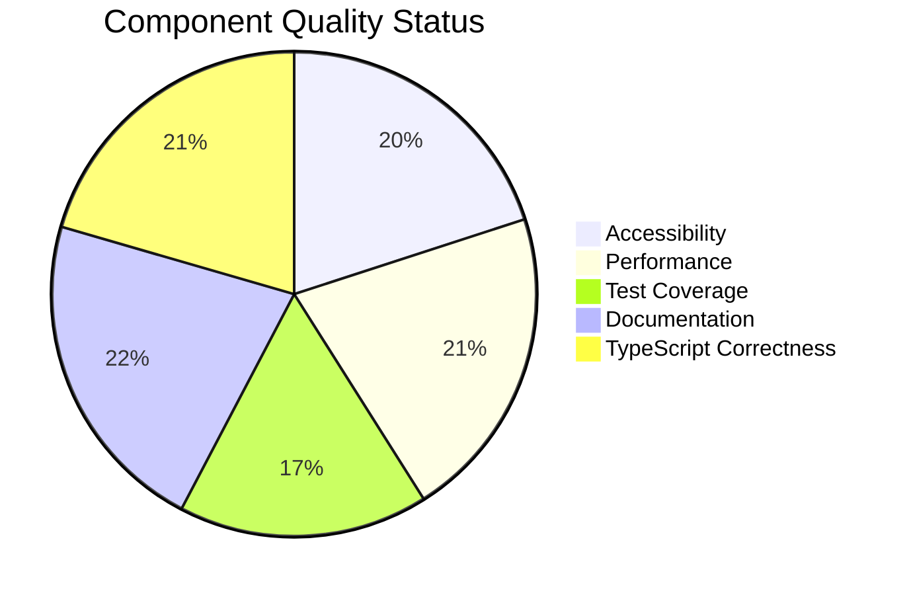

### 14. Release Planning

#### Release Roadmap
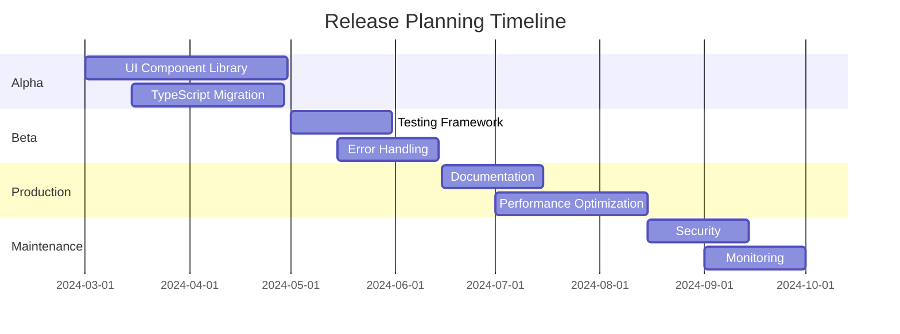

#### Release Milestones

| Milestone | Target Date | Key Deliverables | Status |
|-----------|-------------|------------------|--------|
| Alpha 1.0 | 2024-04-15 | Core UI Components, Initial TypeScript | On Track |
| Alpha 1.5 | 2024-05-15 | Complete UI Library, 75% TypeScript | Planning |
| Beta 1.0 | 2024-06-30 | Testing Framework, Improved Error Handling | Planning |
| RC 1.0 | 2024-07-31 | Documentation, Initial Performance Optimizations | Planning |
| Production 1.0 | 2024-08-30 | Full Release with Security Enhancements | Planning |
| Maintenance 1.1 | 2024-10-15 | Monitoring, Observability Improvements | Planning |

### 15. Dependency Management Strategy

#### Phase 1: Dependency Audit ⏳
- [ ] Create comprehensive dependency inventory
  - [ ] Document direct dependencies
  - [ ] Analyze transitive dependencies
  - [ ] Identify unused dependencies
  - [ ] Catalog license compliance
  - [ ] Assess security vulnerabilities
  - [ ] Evaluate maintenance status
  - [ ] Document version constraints

#### Phase 2: Dependency Governance ⏳
- [ ] Implement dependency management policies
  - [ ] Create approval workflows
  - [ ] Set up automated updates
  - [ ] Configure vulnerability scanning
  - [ ] Implement license compliance checks
  - [ ] Create dependency documentation
  - [ ] Set up change notification system
  - [ ] Establish emergency update procedures

#### Phase 3: Optimization Strategy ⏳
- [ ] Implement bundle optimization techniques
  - [ ] Configure code splitting
  - [ ] Implement tree shaking
  - [ ] Set up dynamic imports
  - [ ] Create bundle analysis
  - [ ] Implement dependency budgets
  - [ ] Configure CI/CD integration
  - [ ] Create optimization documentation

#### Dependency Health Metrics
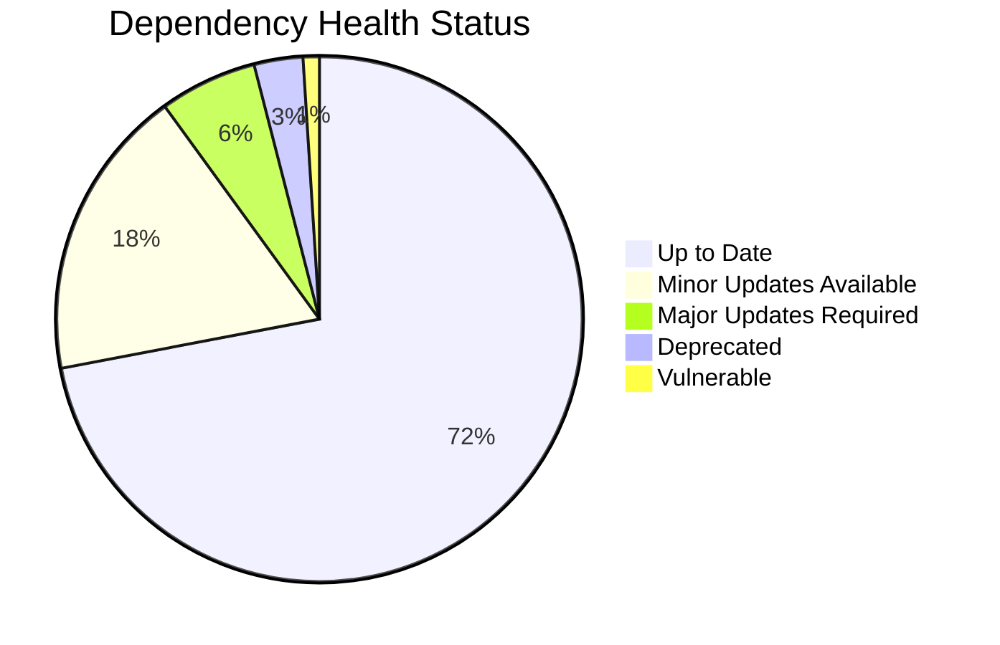

### 16. Third-Party Tool Integration Strategy

#### Phase 1: Tool Selection and Infrastructure Setup ⏳
- [ ] Implement code analysis tools
  - [ ] Configure SonarQube for static analysis
  - [ ] Set up CodeClimate for automated reviews
  - [ ] Implement DeepSource with autofix capabilities
  - [ ] Configure Codacy for complexity metrics
  - [ ] Integrate with existing CI/CD pipeline
  - [ ] Set up custom rule configurations
  - [ ] Create baseline quality reports

#### Phase 2: CI/CD Enhancement ⏳
- [ ] Upgrade automation infrastructure
  - [ ] Implement Jenkins/CircleCI workflows
  - [ ] Configure automated testing pipelines
  - [ ] Set up deployment automation
  - [ ] Implement trunk-based development
  - [ ] Configure branch protection rules
  - [ ] Add automated quality gates
  - [ ] Implement deployment verification

#### Phase 3: Collaboration Workflow Optimization ⏳
- [ ] Enhance GitHub workflow
  - [ ] Configure structured PR templates
  - [ ] Implement automated code owners
  - [ ] Set up Gerrit for detailed code reviews
  - [ ] Create automated labeling system
  - [ ] Implement project board automation
  - [ ] Configure status check requirements
  - [ ] Set up automated documentation updates

#### Phase 4: Metrics and Reporting ⏳
- [ ] Implement analytics dashboards
  - [ ] Create code quality trending reports
  - [ ] Configure security vulnerability tracking
  - [ ] Implement technical debt metrics
  - [ ] Set up performance regression detection
  - [ ] Create team velocity analytics
  - [ ] Configure automated improvement suggestions
  - [ ] Implement ROI reporting on improvements

### Tool Integration Progress
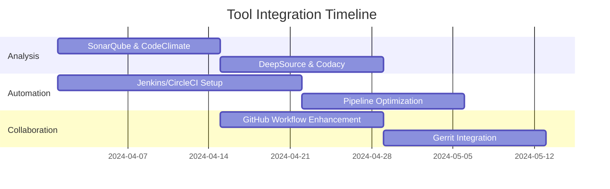

### Tool Impact Metrics
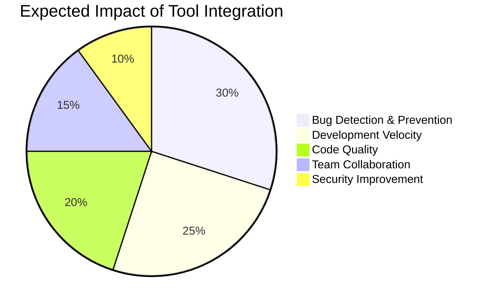
